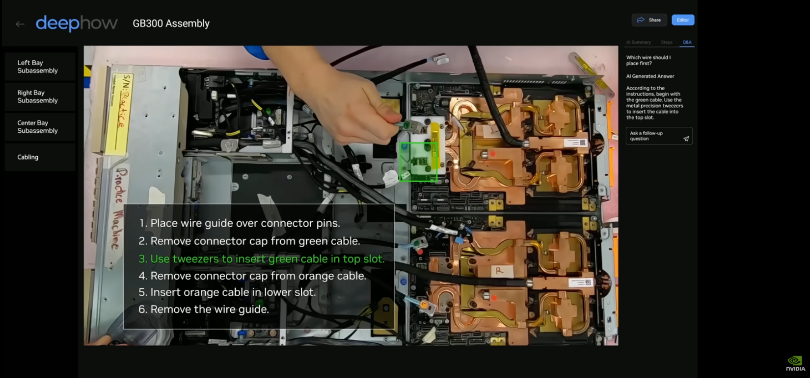

# SoPilot


version 1.6

5/24/2026

SOP stands for Standard Operating Procedure, a step-by-step protocol that ensures consistency and quality across physical and regulated workflows. The global SOP management market is around $5.5B in 2026, projected to reach $9.3B by 2033 [1,2]. SOPs are the backbone of repeatable work in healthcare, labs, manufacturing, field service, and safety programs. When followed correctly, they reduce rework, training costs, audit risk, and human error. When skipped or inconsistently checked, the fallout includes failed inspections, customer claims, product defects, and safety incidents. A practical validation tool therefore has direct market value: it turns everyday workflow video into measurable compliance evidence without enterprise-scale AI budgets.

SoPilot is a local-first SOP video checker for physical workflows. It is inspired by GB300 manufacturing process in NVIDIA 2026 keynote speech on GTC Washington, D.C. 
That direction is personal for this project: **I was one of the three engineers who developed the demo referenced in that keynote segment**.
Continue along the line, I further propose a novel SOUP rule engine quickly combine YOLO [3] and Apple FastVLM [4], a Vision Language Model (VLM), to decide whether each SOP step passed, failed, or needs review.




- [NVIDIA GTC Washington, D.C. Keynote with CEO Jensen Huang, demo around **1:31:04**](https://www.youtube.com/watch?v=lQHK61IDFH4&t=5464s)


The target users—small clinics, labs, factories, field-service teams, trainers, and operators—face two practical problems with today's "ask a VLM about the video" approach:

- Fine-tuning and running large VLMs for every long-tail SOP object is prohibitively expensive.
- Raw workflow video contains private medical, workplace, customer, or facility data that should stay on-device by default.

SoPilot's answer is simple: keep the video and final decision local, train a small detector for domain objects, and use VLMs only as optional advisory help for ambiguous cases.

**Slogan:** Affordable SOP validation. Private by default. Auditable step by step.

---

## Hackathon Snapshot

| Item | Details |
|---|---|
| Challenge | webAI YOLO26 MLX Build Challenge — May 2026 |
| Track | Enterprise, with healthcare/home SOP validation as the demo domain |
| Project | SoPilot — local-first SOP video checker powered by the SOUP Engine |
| Core model | YOLO26 MLX `yolo26n`, running locally on Apple Silicon |
| Custom classes | `cuff`, `sleeve`, `upper_arm` |
| Rule engine | `sandbox/soup-engine`, standalone Python package `sopilot-rules` |
| Main design doc | [SOUP.md](SOUP.md) |
| Github | https://lnkd.in/gEUbb9qU |
| Social post | https://www.linkedin.com/feed/update/urn:li:activity:7464565777464004608/  |
| Hardware | Macbook Air 2026, M4, 24GB RAM |
| Team | Zhen Song, Issac Yenca | 


Official challenge brief: [webAI YOLO26 MLX Build Challenge](https://community.webai.com/t/the-yolo26-mlx-build-challenge-may-2026/16).

---

## What SoPilot Does

The BP Monitor demo checks whether the user follows this physical SOP:

1. Monitor is visible.
2. Sleeve is rolled up.
3. Cuff is placed on the upper arm.
4. Cuff position is valid.
5. Measurement happens only after setup is complete.

Instead of sending a video to a cloud VLM and asking for a free-form judgment, SoPilot:

1. Runs YOLO26 MLX locally to detect objects such as `cuff`, `sleeve`, and `upper_arm`.
2. Converts detections into structured evidence with timestamps, boxes, labels, and confidence.
3. Evaluates SOUP rules locally for geometry, order, timing, and required steps.
4. Produces a pass / quit / needs-review result with an audit trace.

The rule engine is the final decision maker. VLM output, when used, is just another event that local rules can accept or reject.


**Fig. 3.** SOUP Engine data flow across training and runtime phases.

**Training phase (bottom).** A domain expert collects videos of the workflow being performed correctly and incorrectly, extracts representative frames, and labels the objects that matter (`cuff`, `sleeve`, `upper_arm`, `blood_pressure_monitor`, `grey_connector`, etc.). These labels train a small YOLO detector that specializes in the domain's vocabulary. The workflow is iterative — label, train, test, review errors, add examples, retrain — and produces a YOLO `.npz` model in the 10–100 MB range. In parallel, the expert authors the `.soup` package (metadata, steps, tags, rules), increasingly with LLM assistance (see §5).

**Runtime phase (top).** The trained YOLO model is deployed inside the macOS app. During live video or a recorded playback, the app samples frames, runs YOLO locally to produce bounding boxes / labels / confidences, and overlays them on the preview. Detections are normalized into the SOUP schema and combined with scene events (button presses, timer ticks, UI markers). The SOUP rule engine evaluates the combined evidence against the `.soup` package and produces a step-by-step result with an explicit decision trace. An optional local VLM may add ambiguity explanations, and an optional cloud VLM may be consulted *only* after redaction, *only* for ambiguous frames, and *only* with user confirmation — never as the decision-maker.


---

## Why This Matters

Physical SOP validation is useful in settings where mistakes are expensive but full enterprise AI infrastructure is unrealistic: medical-device setup, lab protocols, equipment inspection, shop-floor procedures, safety checks, and field service.

The naive VLM-first path has poor economics. In [SOUP.md](SOUP.md), the estimated VLM fine-tuning path is roughly:

| Scope | VLM fine-tuning path | SOUP hybrid path |
|---|---:|---:|
| 10 SOP pilot | ~$23k–$71k dev cost | ~$8k–$20k dev cost |
| 100 SOP productization | ~$82k–$312k dev cost | ~$51k–$154k dev cost |

The cost reduction comes from shifting domain learning away from a large VLM and into a small YOLO detector plus explicit local rules. The privacy benefit comes from keeping raw video, SOP rules, model weights, and final decisions local by default.


## SOUP Recap

SOUP means **Standard Operating Understanding Package**. A SOUP package is the installable definition of a physical SOP: what objects matter, what steps must happen, what relationships count as correct, which model provides evidence, and which privacy mode is allowed.

Key points from [SOUP.md](SOUP.md):

- **VLMs are not enough.** General VLMs can miss long-tail domain objects such as a blood-pressure cuff, HVAC connector, shop-floor jig, or specialized tool.
- **Fine-tuning VLMs is often the wrong first move.** The project's estimate puts VLM fine-tuning out of reach for many 10-SOP deployments.
- **YOLO handles domain grounding.** A small YOLO detector learns the site-specific objects and runs locally.
- **Rules handle correctness.** The SOUP engine evaluates geometry, sequence, timing, confidence, and required-step rules.
- **VLMs remain useful, but advisory.** A local or guarded cloud VLM can help with ambiguous scene understanding, but it never owns the final decision.
- **The result is auditable.** Each decision maps back to a step, rule, evidence frame, confidence, and privacy log.

SOUP is not trying to make every user "ship SOP as code." The user-facing product is simpler: install or create a package, run the workflow, and get a private, explainable result.

---

## Demo Cases

### Case 1 — Correct BP workflow


The user rolls up the sleeve, places the cuff on the upper arm, and completes measurement. The engine reaches the final state:

```text
SOUP state=Done ... message=measurement_done occurred after all required steps.
FINAL_SOUP_STATUS=passed
TASK_FINISHED=true
```

### Case 2 — Sleeve not rolled


The cuff overlaps the sleeve. SoPilot rejects the run and tells the user where to recover:

```text
FINAL_SOUP_STATUS=quit
ERROR=need to roll up sleeve, go to 'S1' step
TASK_FINISHED=false
```

### Case 3 — Process hack / ambiguous action


The user presents cuff-like visual evidence without clearly placing the cuff on the upper arm. YOLO detects objects, then local FastVLM is used once as a semantic cross-check. The VLM answer is uncertain, so the SOUP rule engine does not pass the workflow:

```text
VLM_ANSWER_NORMALIZED=unsure
SOUP state=Confirm cuff on upper arm ... decision=uncertain ... message=The cuff was not confirmed on the upper arm.
FINAL_SOUP_STATUS=needs_review
TASK_FINISHED=false
```

---

## How YOLO26 MLX Is Used

YOLO26 MLX is the local perception layer for the demo.

| Component | Role |
|---|---|
| Model variant | `yolo26n` |
| Runtime | Apple MLX / Apple Silicon |
| Custom BP model | `images/BP_sc_runs/train/bp_sc_yolo26n.npz` |
| Classes | `cuff`, `sleeve`, `upper_arm` |
| Output | Bounding boxes, labels, confidence, timestamps |
| SOUP use | Rule evidence for object presence, overlap, position, and sequence |

The detector is small enough to run locally and specific enough to catch domain objects that a general VLM may not name reliably.

---

## How To Run

The repo contains two related Python packages: YOLO26 MLX at the repo root and the SOUP rule engine under `sandbox/soup-engine`.

### 1. Install local packages

```bash
python3 -m venv .venv
source .venv/bin/activate
python -m pip install --upgrade pip
python -m pip install -e ".[tracking,vlm]"
python -m pip install -e sandbox/soup-engine
```

For rule-engine-only work, the root YOLO package is not required:

```bash
python -m pip install -e sandbox/soup-engine
```

### 2. Validate the BP SOUP package

```bash
python -m sopilot_rules.tools.validate_soup \
  sandbox/soup-engine/tests/fixtures/bp/bp_monitor.soup.json
```

### 3. Run rule-engine tests

```bash
cd sandbox/soup-engine
python3 -m unittest discover -s tests -p "test_*.py"
```

### 4. Run the correct BP video integration

From the repo root:

```bash
SOUP_RUN_VIDEO_INTEGRATION=1 \
SOUP_VIDEO_PATH=sandbox/BP-video/BP_cuff_correct.mp4 \
SOUP_LOG_PATH=sandbox/BP-video/test_log_SOUP_cuff_correct.log \
python sandbox/soup-engine/tests/integration/test_SOUP_sleeve.py
```

Expected result:

```text
FINAL_SOUP_STATUS=passed
TASK_FINISHED=true
```

### 5. Run the sleeve-not-rolled case

```bash
SOUP_RUN_VIDEO_INTEGRATION=1 \
SOUP_SIMPLE_CUFF_ON_SLEEVE_QUIT=1 \
SOUP_VIDEO_PATH=sandbox/BP-video/BP_sleeve.mp4 \
SOUP_LOG_PATH=sandbox/BP-video/BP-sleeve-wrong.log \
python sandbox/soup-engine/tests/integration/test_SOUP_sleeve.py
```

Expected result:

```text
FINAL_SOUP_STATUS=quit
TASK_FINISHED=false
```

### 6. Run the hack / VLM cross-check case

This requires the local FastVLM setup used by `sandbox/macCamera`.

```bash
SOUP_RUN_VIDEO_INTEGRATION=1 \
python sandbox/soup-engine/tests/integration/test_SOUP_bp_hack_vlm.py
```


Expected result:

```text
FINAL_SOUP_STATUS=needs_review
TASK_FINISHED=false
TEST=passed
```

---

## Repository Map

| Path | Purpose |
|---|---|
| [SOUP.md](SOUP.md) | Full SOUP design paper and cost argument |
| [yolo26-README.md](yolo26-README.md) | YOLO26 MLX implementation notes and benchmarks |
| `src/yolo26mlx/` | YOLO26 MLX package |
| `images/BP_sc_runs/train/bp_sc_yolo26n.npz` | Custom BP detector used by the demo |
| `sandbox/soup-engine/` | Standalone deterministic SOUP rule engine |
| `sandbox/soup-engine/tests/fixtures/bp/` | BP SOUP fixtures |
| `sandbox/soup-engine/tests/integration/` | BP video integration tests |
| `sandbox/BP-video/` | Demo videos, overlays, and logs |
| `doc/img/` | README and SOUP paper images |

---

## Privacy Model

Default mode is local-first:

- Raw video stays local.
- YOLO model weights stay local.
- SOP rules stay local.
- The final pass / fail / needs-review decision is local.
- Local VLM is optional and advisory.
- Cloud VLM, if enabled later, must be user-approved, minimized/redacted, and advisory only.

This matters because SOP videos can show patients, homes, employees, facilities, products, tools, customer sites, and regulated workflows.

---

## What Makes SoPilot Different

| Generic VLM SOP checker | SoPilot |
|---|---|
| Sends video to a model and asks "did this pass?" | Runs local detection and local rules first |
| Expensive to adapt to domain objects | Trains a small YOLO detector for those objects |
| Hard to audit | Returns step-level decisions and evidence |
| Privacy depends on cloud policy | Private by default |
| VLM may become the judge | Rule engine is always the judge |

---

## Limitations

This is a hackathon MVP, not a medical device or regulated compliance product.

- The BP demo is workflow assistance only, not medical diagnosis.
- The current detector focuses on `cuff`, `sleeve`, and `upper_arm`.
- Some events are synthetic or inferred in the current harness.
- More training data is needed for robust lighting, camera angle, occlusion, clothing, skin tone, and device variation.
- The local FastVLM hack test depends on local model availability.

---

## Roadmap

1. Replace synthetic BP events with app-derived or device-derived events.
2. Add more BP tags: monitor, connector, button, elbow bend.
3. Improve tracking, temporal smoothing, and camera calibration.
4. Add Creator Mode for labeling, rule authoring, and package export.
5. Add evidence review UI and privacy-log export.
6. Build a SOUP package gallery / marketplace.

---

## Submission Links

- GitHub repo: https://github.com/robot007/SoPilot
- 1-minute demo video: https://youtu.be/OCmniMj3spg
- Social post: TODO


Dr. Zhen Song
zhensong23931@gmail.com

5/24/2026

[1] SOP Management Solution Market, Persistence Market Research: https://www.persistencemarketresearch.com/market-research/sop-management-solutions-market.asp
[2] SOP Management Solution Market, Precedence Research: https://www.precedenceresearch.com/sop-management-solution-market
[3] Redmon, J., Divvala, S., Girshick, R., & Farhadi, A. (2016). You Only Look Once: Unified, Real-Time Object Detection. CVPR 2016. https://arxiv.org/abs/1506.02640
[4] Vasu, P. K. A., Faghri, F., Li, C. L., Koc, C., True, N., Antony, A., Santhanam, G., Gabriel, J., Grasch, P., Tuzel, O., & Pouransari, H. (2025). FastVLM: Efficient Vision Encoding for Vision Language Models. CVPR 2025. https://arxiv.org/abs/2412.13303
