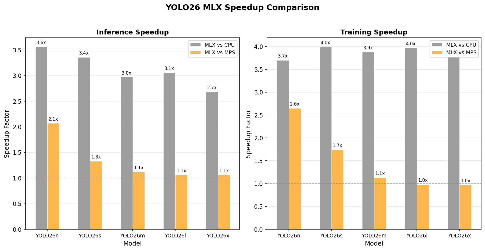
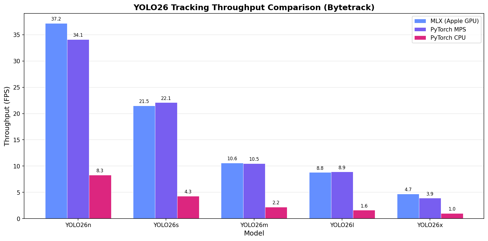
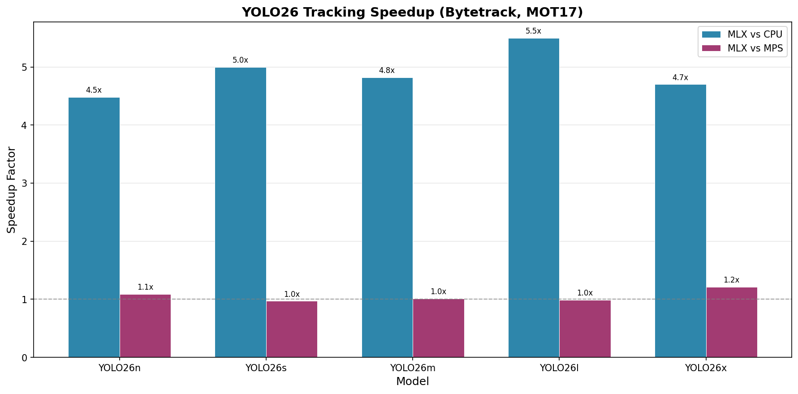
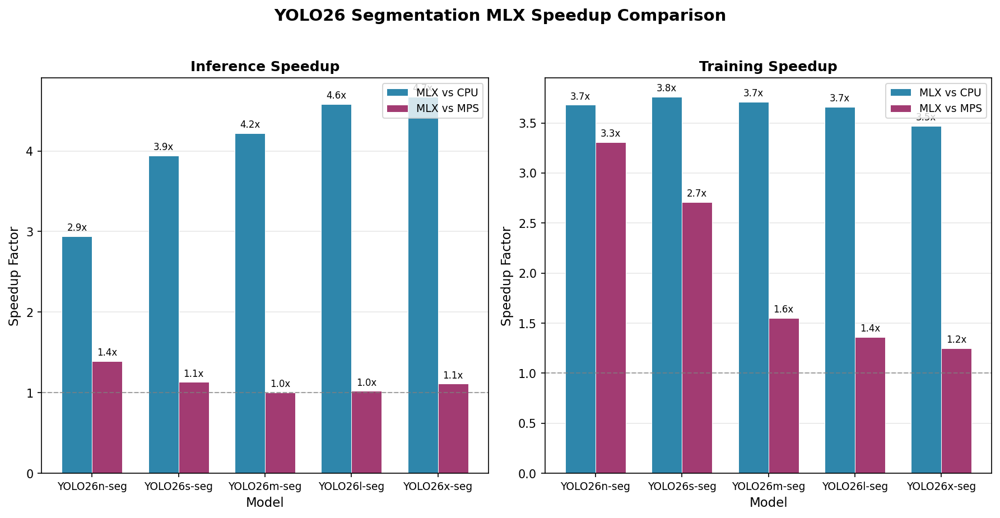
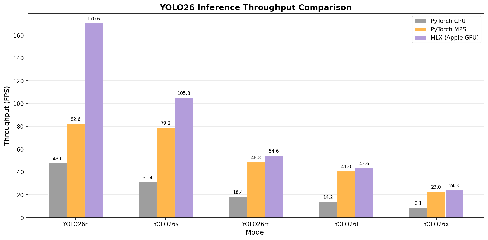
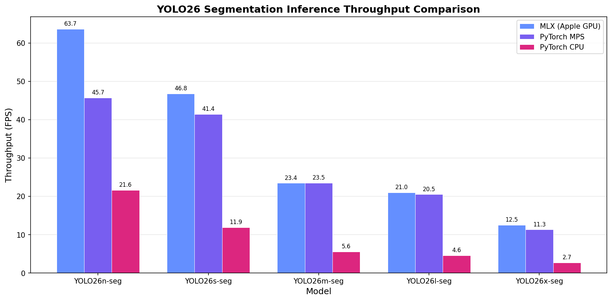
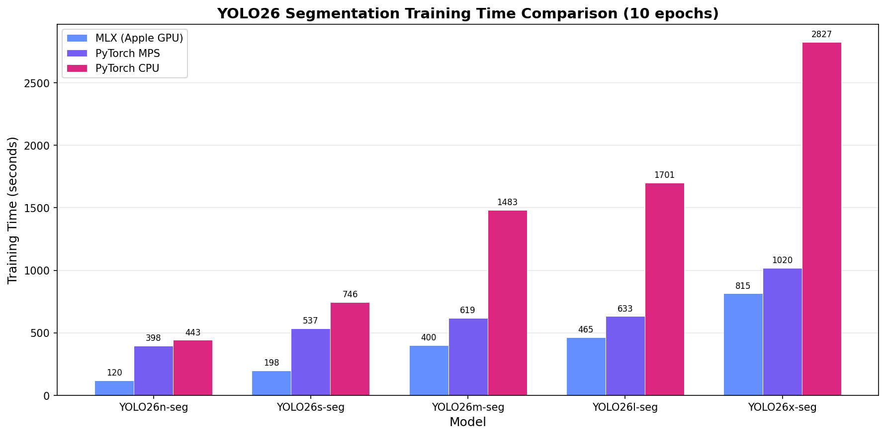

# YOLO26 MLX

[](LICENSE)
[](https://www.python.org)
[](https://github.com/ml-explore/mlx)
[](https://support.apple.com/en-us/116943)
[](https://github.com/thewebAI/yolo-mlx/actions/workflows/ci.yml)

Pure [MLX](https://github.com/ml-explore/mlx) implementation of YOLO26 for Apple Silicon. No PyTorch dependency at runtime.

YOLO26 is the latest generation of the [YOLO](https://docs.ultralytics.com/models/yolo26/) real-time object detection family by [Ultralytics](https://github.com/ultralytics/ultralytics), featuring NMS-free end-to-end detection and simplified DFL-free box regression. This project re-implements the full inference and training pipeline in Apple's [MLX](https://github.com/ml-explore/mlx) framework for native Metal GPU acceleration on Apple Silicon.

## Table of Contents

- [Highlights](#highlights)
- [Validation Results](#validation-results-coco-val2017-5000-images)
- [Tracking Results](#tracking-results-mot17-bytetrack) 
- [Segmentation Results](#segmentation-results-coco-val2017-5000-images) 
- [Performance](#performance)
- [Requirements](#requirements)
- [Project Structure](#project-structure)
- [Quick Start: Inference](#quick-start-inference)
- [Quick Start: Training](#quick-start-training)
- [Quick Start: Tracking](#quick-start-tracking) 
- [Quick Start: Tracking Training](#quick-start-tracking-training) 
- [Quick Start: Segmentation](#quick-start-segmentation) 
- [Quick Start: Segmentation Training](#quick-start-segmentation-training) 
- [Full Setup](#full-setup)
- [Inference Benchmarking](#inference-benchmarking)
- [COCO val2017 Validation](#coco-val2017-validation-map)
- [Training Benchmarking](#training-benchmarking)
- [MOT17 Tracking Evaluation](#mot17-tracking-evaluation) 
- [Segmentation Inference Benchmarking](#segmentation-inference-benchmarking) 
- [COCO val2017 Segmentation Validation](#coco-val2017-segmentation-validation-map) 
- [Segmentation Training Benchmarking](#segmentation-training-benchmarking) 
- [Architecture](#architecture)
- [Contributing](#contributing)
- [License](#license)

## Highlights

- **Pure MLX** — 100% MLX at runtime, leverages Metal GPU acceleration via `mx.compile`
- **Apple Silicon Optimized** — Designed for M1/M2/M3/M4 chips
- **End-to-End Detection** — NMS-free detection with one-to-one matching
- **Full Training Pipeline** — MuSGD and AdamW optimizers, EMA, warmup, LR scheduling
- **Official-Matching Accuracy** — COCO val2017 mAP with most models within 0.2% and a maximum deviation of 0.5%.
- **Multi-Object Tracking** — ByteTrack and BoT-SORT trackers with pure-MLX Kalman filters, MOT17 evaluation support
- **Instance Segmentation** — Segment26 head with multi-scale Proto26, mask mAP matching official results 

## Validation Results (COCO val2017, 5000 images)

| Model | MLX mAP50-95 | Official mAP50-95 | Gap | FPS |
|-------|-------------|-------------------|------|-----|
| yolo26n | **40.2%** | 40.1% | +0.1% | 170.6 |
| yolo26s | **47.6%** | 47.8% | -0.2% | 105.3 |
| yolo26m | **52.3%** | 52.5% | -0.2% | 54.6 |
| yolo26l | **53.9%** | 54.4% | -0.5% | 43.6 |
| yolo26x | **56.7%** | 56.9% | -0.2% | 24.3 |

## Tracking Results (MOT17, ByteTrack) 

Evaluated on MOT17-09-SDP sequence (525 frames) with ByteTrack tracker on **Apple M4 Pro**. MOTA/IDF1 cross-validated against PyTorch (MPS & CPU).

| Model | MLX MOTA | PyTorch MOTA | MLX IDF1 | MLX FPS | MPS FPS | CPU FPS | MLX vs CPU |
|-------|----------|-------------|----------|---------|---------|---------|------------|
| yolo26n | **46.6** | 45.2 | 56.1 | **37.2** | 34.1 | 8.3 | **4.5×** |
| yolo26s | **46.6** | 44.9 | 50.6 | 21.5 | 22.1 | 4.3 | **5.0×** |
| yolo26m | **45.6** | 38.2 | 54.6 | **10.6** | 10.5 | 2.2 | **4.8×** |
| yolo26l | **48.5** | 42.2 | 53.5 | 8.8 | 8.9 | 1.6 | **5.5×** |
| yolo26x | **38.7** | 35.1 | 52.5 | **4.7** | 3.9 | 1.0 | **4.7×** |

## Segmentation Results (COCO val2017, 5000 images) 

| Model | MLX mAP<sup>mask</sup> | Official mAP<sup>mask</sup> | MLX mAP<sup>box</sup> | Official mAP<sup>box</sup> | FPS |
|-------|------------------------|-------------------------------|------------------------|-------------------------------|-----|
| yolo26n-seg | **33.6** | 33.9 | **39.5** | 39.6 | 63.7 |
| yolo26s-seg | **39.7** | 40.0 | **47.2** | 47.3 | 46.8 |
| yolo26m-seg | **43.7** | 44.1 | **52.1** | 52.5 | 23.4 |
| yolo26l-seg | **45.2** | 45.5 | **54.2** | 54.4 | 21.0 |
| yolo26x-seg | **46.6** | 47.0 | **56.2** | 56.5 | 12.5 |

## Performance

All benchmarks were run on an **Apple M4 Pro** with macOS 26.3.1 and Python 3.14.3. YOLO26 MLX delivers significant speedups over PyTorch on Apple Silicon. For inference, MLX is up to **2.07× faster** than PyTorch MPS (yolo26n: 170.6 vs 82.6 FPS) and up to **3.56× faster** than PyTorch CPU. For training (COCO128, 10 epochs), MLX is up to **2.65× faster** than MPS (yolo26n: 64.1s vs 169.8s) and up to **3.99× faster** than CPU. For tracking (MOT17, imgsz=1440), MLX matches or exceeds PyTorch MPS speed (faster for n, m, x; tied for s, l), while both are **4.5–5.5× faster** than PyTorch CPU. For segmentation (COCO val2017 + COCO128-Seg, imgsz=640), MLX matches official mask mAP within **0.3–0.4 pp** and is **1.00×–1.39× faster than MPS** for inference and **1.25×–3.31× faster than MPS** for training. Smaller models benefit the most from MLX's Metal-optimized compute graph and `mx.compile` JIT, while larger models converge toward parity as the workload becomes compute-bound.



MLX matches or exceeds PyTorch MPS tracking speed at imgsz=1440. MLX is faster for n, m, and x models; tied with MPS for s and l. Both are **4.5–5.5× faster** than PyTorch CPU. Tracking overhead is ~3–5 ms/frame thanks to batched Kalman updates and batch-precomputed coordinates. FPS numbers reflect wall-clock throughput; expect ~10% run-to-run variance on Apple Silicon.





 For segmentation, MLX matches official Ultralytics mask mAP within **0.3–0.4 pp** and box mAP within **0.1–0.4 pp** on COCO val2017 (5,000 images), evaluated with `pycocotools` at original-image resolution (RLE-encoded predictions) — the same methodology Ultralytics uses for its published numbers (`model.val(save_json=True)` → `process_mask_native` + pycocotools). For inference, MLX is faster than (or tied with) PyTorch MPS across all 5 model sizes — up to **1.39× faster** end-to-end (yolo26n-seg: 63.7 vs 45.7 FPS) and up to **4.67× faster** than PyTorch CPU (yolo26x-seg: 12.5 vs 2.7 FPS); forward-pass-only timings are MLX-favorable on every size including m-seg (35.5 ms vs 40.3 ms, 1.14×). For training (COCO128-Seg, 10 epochs, batch=4), MLX is the fastest backend on every size — **1.25×–3.31× faster than PyTorch MPS** and **3.47×–3.76× faster than PyTorch CPU**. See [GUIDE_SEGMENTATION.md](GUIDE_SEGMENTATION.md) for the full per-model breakdown.



## Requirements

- macOS with Apple Silicon (M1/M2/M3/M4)
- Python 3.10+
- MLX >=0.30.3, <0.31

## Project Structure

```
yolo-mlx/
├── src/yolo26mlx/                 # Core MLX package
│   ├── cfg/                       # Model, dataset, and tracker YAML configs
│   │   ├── models/26/yolo26-seg.yaml  # Segmentation model architecture
│   │   └── datasets/coco128-seg.yaml  # COCO128-Seg dataset config
│   ├── converters/                # PyTorch -> MLX weight converter
│   ├── data/                      # Data loading, COCODataset (detection + segmentation)
│   ├── engine/                    # YOLO, Predictor, Trainer, Validator, TrackerManager, Results
│   ├── nn/                        # Network blocks: Detect, Segment26, Proto26, model builder
│   ├── optim/                     # MuSGD and AdamW optimizers
│   ├── trackers/                  # ByteTrack, BoT-SORT, Kalman filters, matching
│   └── utils/                     # Losses (v8SegmentationLoss), ops, TAL, metrics, video I/O
├── scripts/                       # Benchmark/eval/download utilities
├── configs/                       # Dataset configs used by scripts
├── tests/                         # Unit/integration tests
├── GUIDE_INFERENCE_VALIDATION.md  # Inference + COCO validation guide
├── GUIDE_SEGMENTATION.md          # Instance segmentation guide
├── GUIDE_TRACKING.md              # Tracking guide
├── GUIDE_TRAINING_BENCHMARK.md    # Training benchmark guide
├── CHANGELOG.md
├── CONTRIBUTING.md
├── LICENSE                        # AGPL-3.0
├── Makefile                       # Common dev tasks (lint, format, test)
├── README.md
├── pyproject.toml
└── webAI-contributor-license-agreement.md

# Runtime folders (created by scripts when needed)
datasets/
images/
models/
results/
```

---

## Quick Start: Inference

Run object detection on an image in under 5 minutes.

```bash
# 1. Setup
cd yolo-mlx
python3 -m venv .venv && source .venv/bin/activate
pip install -e .
pip install -e ".[convert]"

# 2. Download a pretrained model and convert to MLX format
bash scripts/download_yolo26_models.sh          # downloads all .pt weights to models/
yolo-mlx converters convert models/yolo26n.pt -o models/yolo26n.npz --verify

# 3. Run inference
mkdir -p images
curl -fsSL -o images/bus.jpg https://ultralytics.com/images/bus.jpg
```

```python
from yolo26mlx import YOLO

model = YOLO("models/yolo26n.npz")
results = model.predict("images/bus.jpg", conf=0.25)
print(results[0])                    # detection summary
results[0].save()                    # saves labeled image to results/
```

The `predict()` method accepts a file path, directory, PIL Image, or numpy array.
Key parameters: `conf` (confidence threshold, default 0.25), `imgsz` (input size, default 640), `save` (auto-save results).

---

## Quick Start: Training

Fine-tune a YOLO26 model on your own data.

```bash
# 1. Setup (if not done already)
cd yolo-mlx
python3 -m venv .venv && source .venv/bin/activate
pip install -e .
pip install -e ".[convert]"

# 2. Download and convert a pretrained model as starting weights
bash scripts/download_yolo26_models.sh
yolo-mlx converters convert models/yolo26n.pt -o models/yolo26n.npz --verify
```

```python
from yolo26mlx import YOLO

# Load pretrained MLX weights
model = YOLO("models/yolo26n.npz")

# Train on COCO128 (auto-downloaded, ~7 MB, 128 images)
results = model.train(
    data="coco128",       # dataset name or path to data YAML
    epochs=10,
    batch=4,
    imgsz=640,
    project="runs/train",
    name="my_experiment",
)
```

To train on a custom dataset, create a YAML config following the COCO format
(see `configs/coco.yaml` for reference) and pass its path as `data`.
Key parameters: `epochs` (default 100), `batch` (default 16), `imgsz` (default 640),
`patience` (early stopping, default 50), `save_period` (checkpoint interval, -1 to disable).

See [GUIDE_TRAINING_BENCHMARK.md](GUIDE_TRAINING_BENCHMARK.md) for detailed training and benchmarking workflows.

---

## Quick Start: Tracking 

Run multi-object tracking on a video in under 5 minutes.

```bash
# 1. Setup (if not done already)
cd yolo-mlx
python3 -m venv .venv && source .venv/bin/activate
pip install -e .
pip install -e ".[tracking]"
pip install -e ".[convert]"

# 2. Download and convert a model
bash scripts/download_yolo26_models.sh
yolo-mlx converters convert models/yolo26n.pt -o models/yolo26n.npz --verify

# 3. Download MOT17 and create a sample pedestrian video (~3s, 1080p)
bash scripts/download_mot17.sh
python scripts/create_sample_video.py       # creates images/pedestrians.mp4
```

```python
from yolo26mlx import YOLO

model = YOLO("models/yolo26n.npz")

# Track pedestrians — saves annotated output to results/pedestrians_tracked.mp4
results = model.track("images/pedestrians.mp4", conf=0.25, save=True)

# Access per-frame results
for r in results:
    if r.boxes.is_track:
        print(r.boxes.id)     # track IDs (persistent across frames)
        print(r.boxes.xyxy)   # bounding boxes
```

### Webcam Tracking

```python
# Real-time tracking from webcam (press 'q' to quit)
results = model.track(0, conf=0.25, show=True)
```

### Frame-by-Frame Control

For custom per-frame processing with `stream=True` (memory-efficient for long videos):

```python
from yolo26mlx import YOLO

model = YOLO("models/yolo26n.npz")
for result in model.track("video.mp4", stream=True):
    boxes = result.boxes
    if boxes.is_track:
        for tid, box in zip(boxes.id, boxes.xyxy):
            print(f"Track {tid}: {box}")
```

The `track()` method supports video files, webcam indices (`0`), and numpy frame arrays.
Key parameters: `tracker` ("bytetrack.yaml" or "botsort.yaml"), `conf` (threshold), `show` (display), `save` (save output video), `vid_stride` (frame skip), `persist` (keep tracker state between calls).

See `scripts/track_demo.py` for a complete tracking demo with batch and framewise modes.
See [GUIDE_TRACKING.md](GUIDE_TRACKING.md) for the full tracking guide.

**Output locations:**

| Artifact | Path |
|---|---|
| Pretrained weights (`.pt`) | `models/` |
| Converted MLX weights (`.npz`) | `models/` |
| Sample input video | `images/pedestrians.mp4` |
| Annotated tracking video (`save=True`) | `results/pedestrians_tracked.mp4` |

---

## Quick Start: Tracking Training 

Tracking uses standard detection models — no separate training pipeline is needed.
Any YOLO26 model trained on detection can be used directly with `model.track()`.
To improve tracking on a custom domain, fine-tune a detection model on objects
you want to track, then use it for tracking.

```bash
# 1. Setup (if not done already)
cd yolo-mlx
python3 -m venv .venv && source .venv/bin/activate
pip install -e .
pip install -e ".[tracking]"
pip install -e ".[convert]"

# 2. Download and convert a pretrained model as starting weights
bash scripts/download_yolo26_models.sh
yolo-mlx converters convert models/yolo26n.pt -o models/yolo26n.npz --verify
```

```python
from yolo26mlx import YOLO

# Step 1: Fine-tune on your detection dataset
model = YOLO("models/yolo26n.npz")
results = model.train(
    data="coco128",       # dataset name or path to data YAML
    epochs=10,
    batch=4,
    imgsz=640,
    project="runs/train",
    name="my_detector",
)

# Step 2: Use the fine-tuned model for tracking
model = YOLO("runs/train/my_detector/best.safetensors")
results = model.track("video.mp4", conf=0.25, save=True)
```

To train on a custom dataset, create a YAML config following the COCO format
(see `configs/coco.yaml` for reference) and pass its path as `data`.
Key training parameters: `epochs` (default 100), `batch` (default 16), `imgsz` (default 640),
`patience` (early stopping, default 50), `save_period` (checkpoint interval, -1 to disable).
Key tracker parameters: `tracker` ("bytetrack.yaml" or "botsort.yaml"), `conf`, `imgsz`.

**Output locations:**

| Artifact | Path |
|---|---|
| Training checkpoints | `runs/train/<name>/best.safetensors`, `last.safetensors` |
| Annotated tracking video (`save=True`) | `results/<video>_tracked.mp4` |
| Downloaded dataset (auto) | `datasets/coco128/` |

See [GUIDE_TRACKING.md](GUIDE_TRACKING.md) for the full tracking guide and [GUIDE_TRAINING_BENCHMARK.md](GUIDE_TRAINING_BENCHMARK.md) for detailed training and benchmarking workflows.

---

## Quick Start: Segmentation 

Run instance segmentation on an image in under 5 minutes.

```bash
# 1. Setup
cd yolo-mlx
python3 -m venv .venv && source .venv/bin/activate
pip install -e .
pip install -e ".[segment]"
pip install -e ".[convert]"

# 2. Download a pretrained segmentation model and convert to MLX format
bash scripts/download_yolo26_models.sh          # downloads all .pt weights to models/
yolo-mlx converters convert models/yolo26n-seg.pt -o models/yolo26n-seg.npz --verify

# 3. Run segmentation
mkdir -p images
curl -fsSL -o images/bus.jpg https://ultralytics.com/images/bus.jpg
```

```python
from yolo26mlx import YOLO

model = YOLO("models/yolo26n-seg.npz", task="segment")
results = model.predict("images/bus.jpg")
print(results[0])                    # detection + mask summary
results[0].save()                    # saves annotated image with mask overlays to results/
```

Access detection and mask data:

```python
boxes = results[0].boxes             # Boxes object — (N, 6) [x1, y1, x2, y2, conf, cls]
masks = results[0].masks             # Masks object — (N, H, W) binary masks
print(f"Detected {len(boxes)} objects with masks of shape {masks.data.shape}")
```

See [GUIDE_SEGMENTATION.md](GUIDE_SEGMENTATION.md) for the full segmentation guide.

---

## Quick Start: Segmentation Training 

Train a YOLO26-seg model on segmentation data.

```bash
# 1. Setup (if not done already)
cd yolo-mlx
python3 -m venv .venv && source .venv/bin/activate
pip install -e .
pip install -e ".[segment]"
pip install -e ".[convert]"

# 2. Download and convert a pretrained segmentation model as starting weights
bash scripts/download_yolo26_models.sh
yolo-mlx converters convert models/yolo26n-seg.pt -o models/yolo26n-seg.npz --verify
```

```python
from yolo26mlx import YOLO

# Load pretrained segmentation weights
model = YOLO("models/yolo26n-seg.npz", task="segment")

# Train on COCO128-Seg (auto-downloaded, ~7 MB, 128 images with polygon labels)
results = model.train(
    data="coco128-seg",    # dataset name or path to data YAML
    epochs=10,
    batch=4,
    imgsz=640,
    project="runs/train",
    name="my_seg_experiment",
)
```

The segmentation training loss includes five components: box, cls, dfl, seg (per-instance mask), and sem (auxiliary semantic segmentation).

To train on a custom dataset, create polygon-annotation labels in YOLO-seg format
(`class_id x1 y1 x2 y2 ... xN yN` per line, normalized coordinates) and a YAML config
(see `src/yolo26mlx/cfg/datasets/coco128-seg.yaml` for reference).

**Output locations:**

| Artifact | Path |
|---|---|
| Training checkpoints | `runs/train/<name>/best.safetensors`, `last.safetensors` |
| Downloaded dataset (auto) | `datasets/coco128-seg/` |

See [GUIDE_SEGMENTATION.md](GUIDE_SEGMENTATION.md) for the full segmentation guide including evaluation and benchmarking.

---

## Full Setup

```bash
cd yolo-mlx

# Create and activate virtual environment
python3 -m venv .venv
source .venv/bin/activate

# Install the package
pip install -e .

# Install tracking dependencies (OpenCV, lap, scipy — required for model.track())
pip install -e ".[tracking]"

# Install segmentation dependencies (pycocotools, matplotlib, opencv-python — required for model.predict() with task="segment", COCO mask mAP, and chart generation)
pip install -e ".[segment]"

# Install conversion dependencies (required to convert .pt → .npz weights)
pip install -e ".[convert]"
```

For PyTorch MPS/CPU comparison benchmarks, see [GUIDE_INFERENCE_VALIDATION.md](GUIDE_INFERENCE_VALIDATION.md) and [GUIDE_TRAINING_BENCHMARK.md](GUIDE_TRAINING_BENCHMARK.md).

Runtime directories (`datasets/`, `images/`, `models/`, `results/`) are created
automatically by the scripts and evaluation tools when needed.

---

## Inference Benchmarking

Measures MLX inference latency and throughput.

```bash
# All models
python scripts/benchmark_yolo26_inference.py --skip-mps --skip-cpu

# Specific models only
python scripts/benchmark_yolo26_inference.py --models n s --skip-mps --skip-cpu

# More timed runs for stable results
python scripts/benchmark_yolo26_inference.py --runs 20 --skip-mps --skip-cpu
```

**Output:** `results/yolo26_inference_three_way.json` (override with `--output path.json`)

| Metric | Description |
|--------|-------------|
| End-to-end latency (ms) | Full predict including pre/post processing |
| Forward-pass-only (ms) | Model inference only |
| FPS | Throughput (1000 / mean_ms) |
| Peak memory (MB) | MLX Metal memory usage |

The benchmark script also supports PyTorch MPS and CPU backends for comparison. See [GUIDE_INFERENCE_VALIDATION.md](GUIDE_INFERENCE_VALIDATION.md) for full multi-backend benchmarking instructions.

**Defaults:** 3 warmup runs, 10 timed runs, 640×640 image size



---

## COCO val2017 Validation (mAP)

Evaluates accuracy on the full COCO val2017 set (5,000 images) using official pycocotools.

### Setup COCO Dataset

```bash
# Automatic download script
bash scripts/download_coco_val2017.sh datasets/coco

# Or manually:
mkdir -p datasets/coco/images datasets/coco/annotations datasets/coco/labels

curl -L -o datasets/coco/images/val2017.zip http://images.cocodataset.org/zips/val2017.zip
unzip datasets/coco/images/val2017.zip -d datasets/coco/images/
rm datasets/coco/images/val2017.zip

curl -L -o datasets/coco/annotations/annotations_trainval2017.zip http://images.cocodataset.org/annotations/annotations_trainval2017.zip
unzip datasets/coco/annotations/annotations_trainval2017.zip -d datasets/coco/
rm datasets/coco/annotations/annotations_trainval2017.zip

curl -L -o datasets/coco/labels/val2017.zip https://github.com/ultralytics/assets/releases/download/v0.0.0/coco2017labels-segments.zip
unzip datasets/coco/labels/val2017.zip -d datasets/coco/
rm datasets/coco/labels/val2017.zip
```

### Run Validation

```bash
# Single model
python scripts/evaluate_coco_val.py --model yolo26n --data datasets/coco

# All 5 models
python scripts/evaluate_coco_val.py --model all --data datasets/coco

# Quick sanity check (100 images)
python scripts/evaluate_coco_val.py --model yolo26n --data datasets/coco --subset 100

# Custom thresholds
python scripts/evaluate_coco_val.py --model yolo26n --data datasets/coco --conf 0.001 --iou 0.7
```

**Output:** `results/` directory (override with `--output dir/`)

| Metric | Description |
|--------|-------------|
| mAP@0.5:0.95 | Primary COCO metric |
| mAP@0.5 | AP at IoU=0.50 |
| mAP@0.75 | AP at IoU=0.75 |
| mAP (small/medium/large) | AP by object size |

**Defaults:** conf=0.001, IoU=0.7, imgsz=640, batch=16 (all overridable via CLI flags). Max detections per image is fixed at 300 (model constant in `Detect`).

---

## Training Benchmarking

COCO128 dataset (~7 MB, 128 images) is downloaded automatically on first run.

```bash
# All models
python scripts/benchmark_yolo26_training_mlx.py

# Specific models with custom settings
python scripts/benchmark_yolo26_training_mlx.py --models n s --epochs 10 --batch 4
```

**Output:** `results/yolo26_mlx_training_final.json` (override with `--output path.json`)

| Metric | Description |
|--------|-------------|
| Training time (s) | Total wall-clock time |
| Time/epoch (s) | Average per epoch |
| Final loss | End-of-training loss |
| mAP@0.5 | Post-training accuracy |
| Peak memory (MB) | Metal peak memory |

**Training defaults:** 10 epochs, batch=4, COCO128 dataset, optimizer=auto (mirrors Ultralytics: AdamW for ≤10k iter, MuSGD otherwise — short COCO128 runs use AdamW), lr=0.000119 (auto-LR formula `0.002 * 5 / (4 + nc)` for nc=80). All overridable via `--epochs`, `--batch`, `--lr`, `--output`.

For PyTorch MPS/CPU training benchmarks and chart generation, see [GUIDE_TRAINING_BENCHMARK.md](GUIDE_TRAINING_BENCHMARK.md).


---

## MOT17 Tracking Evaluation 

Evaluates tracking accuracy on the [MOT17](https://motchallenge.net/data/MOT17/) training set (7 sequences, 5,316 frames) with ground-truth annotations.

### Setup MOT17 Dataset

```bash
# Automatic download (~5.5 GB)
bash scripts/download_mot17.sh
```

### Run Evaluation

```bash
# MLX evaluation
python scripts/evaluate_mot17.py --model yolo26n
python scripts/evaluate_mot17.py --model all

# PyTorch MPS comparison
python scripts/evaluate_mot17_pytorch.py --model all --device mps

# PyTorch CPU comparison
python scripts/evaluate_mot17_pytorch.py --model all --device cpu

# Quick test on one sequence
python scripts/evaluate_mot17.py --model yolo26n --sequences MOT17-09-SDP

# Use BoT-SORT instead of ByteTrack
python scripts/evaluate_mot17.py --model yolo26n --tracker botsort
```

**Output:** `results/tracking/` directory with JSON results and MOTChallenge-format `.txt` prediction files.

### Generate Tracking Charts

After running evaluations on all backends, collect results and generate comparison charts:

```bash
# Collect results into a single JSON
python scripts/benchmark_tracking_collect_results.py

# Generate charts (MOTA, IDF1, FPS, speedup, overhead, summary dashboard)
python scripts/benchmark_tracking_generate_charts.py
```

**Output:** `results/charts/yolo26_tracking_*.png` (6 charts). Override output directory with `--output`, format with `--format` (png/pdf/svg).

| Metric | Description |
|--------|-------------|
| MOTA | Multi-Object Tracking Accuracy |
| IDF1 | ID F1 Score (identity preservation) |
| MT/ML | Mostly Tracked / Mostly Lost (%) |
| FP/FN | False Positives / False Negatives |
| IDSW | ID Switches |
| Frag | Fragmentations |
| FPS | End-to-end throughput (detection + tracking) |

**Defaults:** imgsz=1440, conf=0.25, IoU=0.7, tracker=bytetrack. All overridable via CLI flags.

See [GUIDE_TRACKING.md](GUIDE_TRACKING.md) for full tracking documentation.

### Per-Sequence Results (yolo26s + ByteTrack, full MOT17 train)

| Sequence | MOTA | IDF1 | FP | FN | IDSW |
|----------|------|------|------|-------|------|
| MOT17-02-SDP | 26.8 | 37.5 | 2,480 | 11,085 | 43 |
| MOT17-04-SDP | 48.3 | 57.9 | 6,349 | 18,173 | 81 |
| MOT17-05-SDP | 29.8 | 48.7 | 1,556 | 3,224 | 77 |
| MOT17-09-SDP | 45.7 | 55.8 | 1,438 | 1,425 | 30 |
| MOT17-10-SDP | 46.2 | 40.9 | 1,721 | 5,118 | 68 |
| MOT17-11-SDP | 43.2 | 56.4 | 2,103 | 3,234 | 22 |
| MOT17-13-SDP | 43.2 | 48.9 | 550 | 6,002 | 58 |
| **Aggregate** | **42.3** | **49.5** | **16,197** | **48,261** | **379** |

---

## Segmentation Inference Benchmarking 

Measures MLX segmentation inference latency and throughput.

```bash
# All models
python scripts/benchmark_yolo26_seg_inference.py --skip-mps --skip-cpu

# Specific models only
python scripts/benchmark_yolo26_seg_inference.py --models n s --skip-mps --skip-cpu

# More timed runs for stable results
python scripts/benchmark_yolo26_seg_inference.py --runs 20 --skip-mps --skip-cpu
```

**Output:** `results/yolo26_seg_inference_three_way.json` (override with `--output path.json`)

| Metric | Description |
|--------|-------------|
| End-to-end latency (ms) | Full predict including pre/post processing and mask generation |
| Forward-pass-only (ms) | Model inference only |
| FPS | Throughput (1000 / mean_ms) |
| Peak memory (MB) | MLX Metal memory usage |

The benchmark script also supports PyTorch MPS and CPU backends for comparison. See [GUIDE_SEGMENTATION.md](GUIDE_SEGMENTATION.md) for full multi-backend benchmarking instructions.

**Defaults:** 3 warmup runs, 10 timed runs, 640×640 image size



---

## COCO val2017 Segmentation Validation (mAP) 

Evaluates mask and box accuracy on the full COCO val2017 set (5,000 images) using official pycocotools with both `iouType='bbox'` and `iouType='segm'`.

### Setup COCO Dataset

COCO val2017 segmentation uses the same dataset as detection (see [COCO val2017 Validation](#coco-val2017-validation-map) above). The `coco2017labels-segments.zip` archive used in that setup already contains polygon labels required for mask evaluation.

### Run Validation

```bash
# Single model
python scripts/evaluate_coco_seg_val.py --model yolo26n-seg --data datasets/coco

# All 5 models
python scripts/evaluate_coco_seg_val.py --model all --data datasets/coco

# Quick sanity check (100 images)
python scripts/evaluate_coco_seg_val.py --model yolo26n-seg --data datasets/coco --subset 100

# Custom thresholds
python scripts/evaluate_coco_seg_val.py --model yolo26n-seg --data datasets/coco --conf 0.001
```

**Output:** `results/yolo26_seg_coco_val_results.json` (override with `--output dir/`)

| Metric | Description |
|--------|-------------|
| mAP<sup>mask</sup>@0.5:0.95 | Primary mask metric |
| mAP<sup>mask</sup>@0.5 | Mask AP at IoU=0.50 |
| mAP<sup>box</sup>@0.5:0.95 | Box detection AP (primary) |
| mAP<sup>box</sup>@0.5 | Box detection AP at IoU=0.50 |
| mAP (small/medium/large) | AP by object size (mask + box) |

**Defaults:** conf=0.001, imgsz=640, batch=16 (all overridable via CLI flags)

---

## Segmentation Training Benchmarking 

COCO128-Seg dataset (~7 MB, 128 images with polygon labels) is downloaded automatically on first run.

```bash
# All models
python scripts/benchmark_yolo26_seg_training_mlx.py

# Specific models with custom settings
python scripts/benchmark_yolo26_seg_training_mlx.py --models n s --epochs 10 --batch 4
```

**Output:** `results/yolo26_seg_mlx_training_final.json` (override with `--output path.json`)

| Metric | Description |
|--------|-------------|
| Training time (s) | Total wall-clock time |
| Time/epoch (s) | Average per epoch |
| Final loss | End-of-training loss |
| mAP@0.5 | Post-training accuracy (mask + box) |
| Peak memory (MB) | Metal peak memory |

**Training defaults:** 10 epochs, batch=4, COCO128-Seg dataset, optimizer=auto (mirrors Ultralytics: AdamW for ≤10k iter, MuSGD otherwise — short COCO128-Seg runs use AdamW), lr=0.000119 (auto-LR formula `0.002 * 5 / (4 + nc)` for nc=80). All overridable via `--epochs`, `--batch`, `--lr`, `--output`.

For PyTorch MPS/CPU segmentation training benchmarks and chart generation, see [GUIDE_SEGMENTATION.md](GUIDE_SEGMENTATION.md).



---

## Architecture

YOLO26 introduces:

- **DFL Removal** — Eliminates Distribution Focal Loss for simpler export and broader edge compatibility
- **End-to-End Detection** — NMS-free inference using one-to-one matching, producing predictions directly without post-processing
- **Simplified Box Regression** — `reg_max=1` removes DFL bins entirely
- **ProgLoss + STAL** — Improved loss functions with notable gains on small-object detection
- **MuSGD Optimizer** — Hybrid of SGD and Muon (Newton-Schulz orthogonalization) with auto LR, inspired by advances in LLM training

## Contributing

Contributions are welcome! Please see [CONTRIBUTING.md](CONTRIBUTING.md) for guidelines.

## License

This project is licensed under the [GNU Affero General Public License v3.0 (AGPL-3.0)](LICENSE).

This project utilizes code from Ultralytics YOLO26 (https://github.com/ultralytics/ultralytics), modified in 2026.

See the [LICENSE](LICENSE) file for the full license text.
