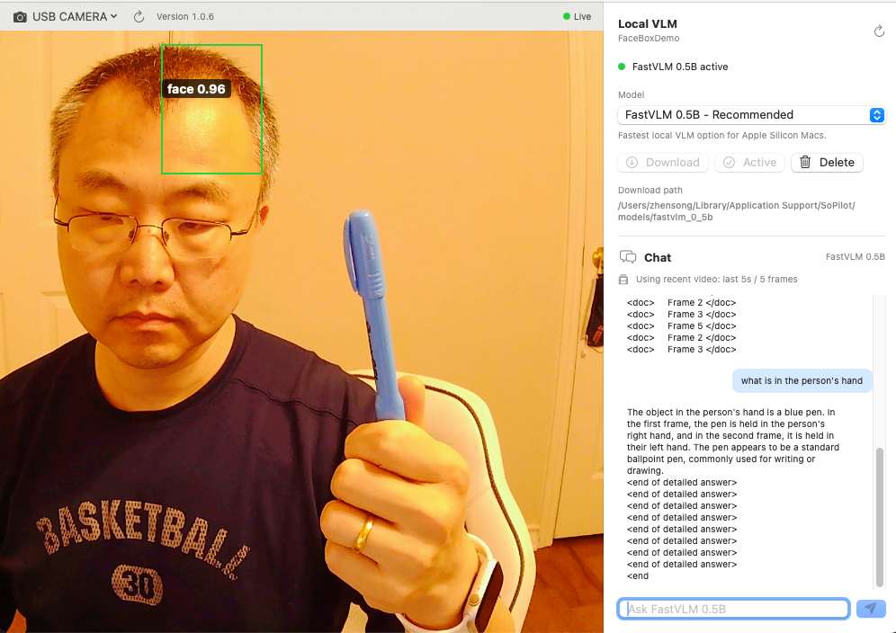
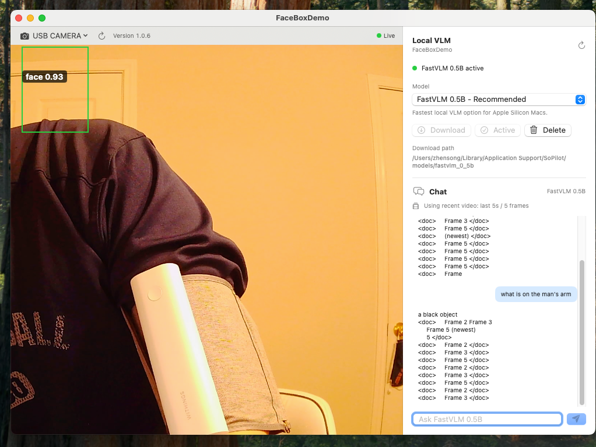
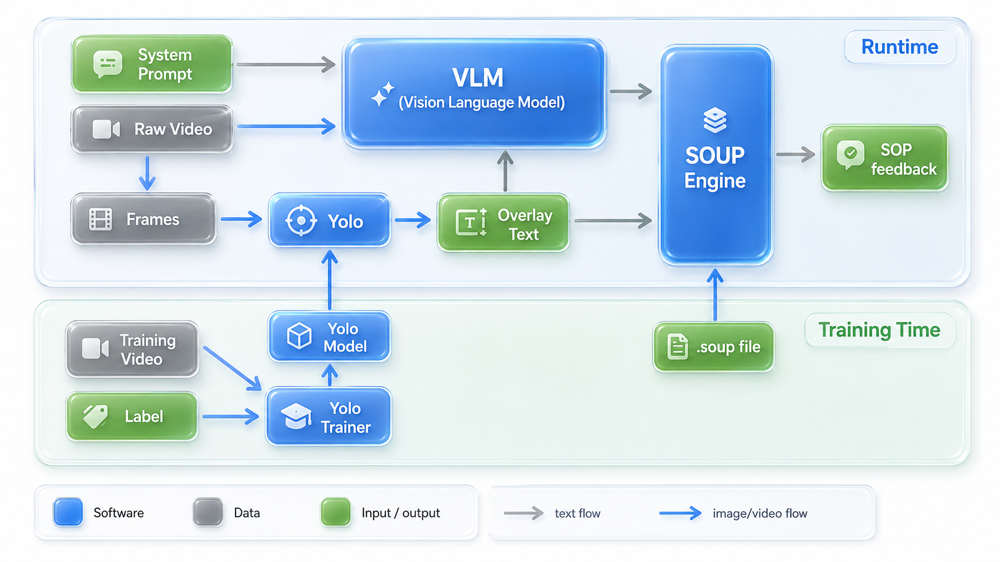
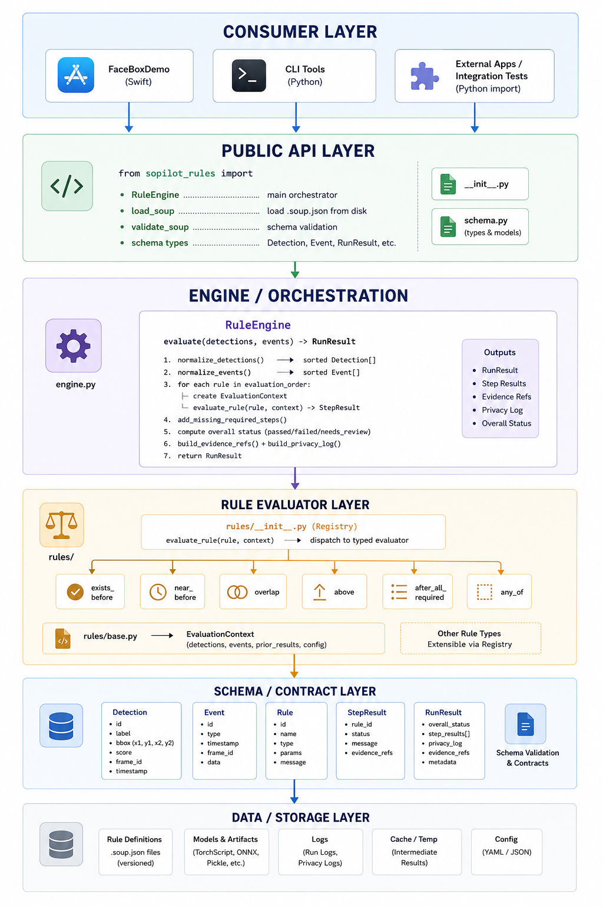
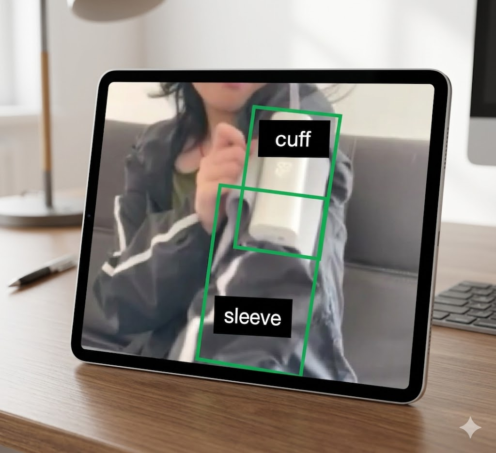
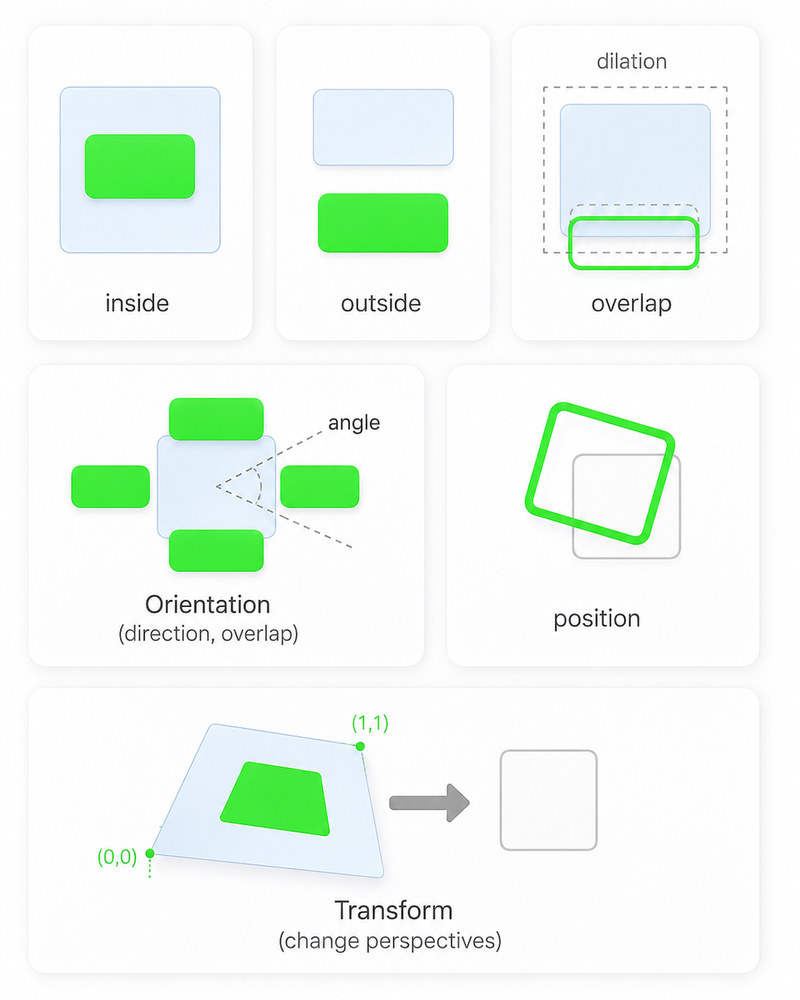
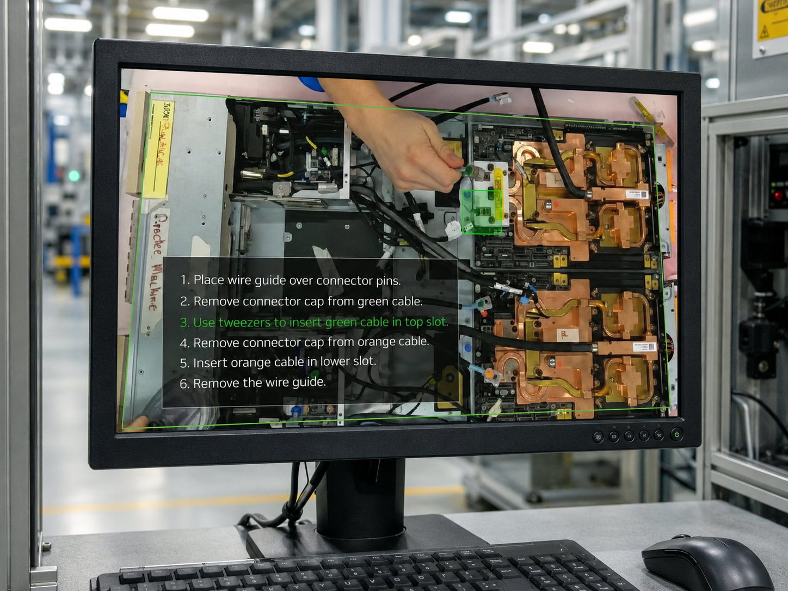
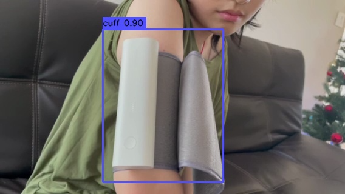
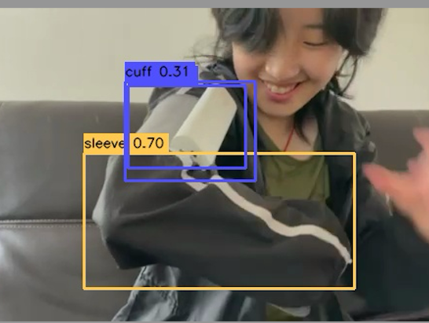
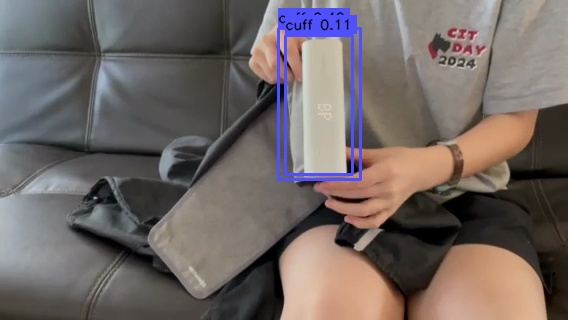

# SOUP Engine: A Hybrid Local-Vision Architecture for Affordable Physical-SOP Validation


version 1.5

5/24/2026

zhensong23931@gmail.com

**Project:** SoPilot — local-first SOP video checker
**Document type:** Hackathon submission tutorial
**Companion documents:** [README.md](./README.md) (product context), [doc/PRD2.0-lit.md](./doc/PRD2.0-lit.md) (hackathon MVP scope), [doc/PRD2.2-lit-claude.md](./doc/PRD2.2-lit-claude.md) (architect review)

---

## Abstract

Vision-Language Models (VLMs) are powerful at general scene understanding but unreliable on domain-specific objects such as medical devices, HVAC components, factory tools, or auto parts. Closing that gap with full or LoRA-style VLM fine-tuning is expensive: our reconciled estimates put a 10-workflow pilot at **$30k–$70k** of one-time development labor and a 100-workflow productization at **$80k–$310k** (see §2.2 and Appendix A). For small businesses, this is prohibitive.

This paper presents the **SOUP Engine** — *Standard Operating Understanding Package* engine — a hybrid architecture that shifts the per-workflow learning burden from a heavy VLM to a small (10–100 MB) YOLO detector, paired with a deterministic local rule engine that consumes both YOLO detections and a general-purpose VLM's scene description. We show that this hybrid reduces dev-labor cost by roughly **50–75%** for the 10-workflow case (§3.2, Appendix C), preserves a strict local-first privacy model, and produces auditable, explainable pass/fail/needs-review decisions. We define a portable `.soup` package format (§5), describe the engine architecture (§4), and walk through a fully working Blood Pressure Monitor example end-to-end (§7).

## Contributions

1. A quantitative argument (§2, Appendix A) that VLM fine-tuning is not affordable for small businesses targeting 10+ physical SOPs.
2. The **hybrid YOLO + Rule-Engine** thesis (§3): shift fine-tuning from billion-parameter VLMs to 10–100 MB YOLO models that can be trained on a laptop, recovering most of the missing domain accuracy at a fraction of the cost.
3. A reusable, portable **`.soup` package format** (§5) that separates *perception* (YOLO, VLM) from *scene events* from *deterministic rules*, with explicit privacy policy and audit trail.
4. A layered **SOUP Engine architecture** (§4) packaged as a standalone Python module reusable across native apps and CLIs.
5. A working **end-to-end Worked Example** (§7) on a real BP Monitor video, with frame-by-frame YOLO detections, synthetic event derivation, and a 5-state rule trace ending in `passed`.

---

## 1. Introduction

Physical Standard Operating Procedures (SOPs) — setting up a medical device, performing a safety inspection, completing a lab protocol, executing a factory or field-service task — are everywhere, and most validation today still depends on manual review, self-reporting, or generic video archives.

A naive AI solution is "ask a cloud VLM whether this video followed the procedure." That approach has three problems:

1. **Privacy.** Raw video of a person performing a medical or workplace procedure is among the most sensitive data a household or business produces.
2. **Cost.** Fine-tuning a VLM to recognize *your* cuff, *your* HVAC connector, or *your* shop-floor jig is a five- to six-figure undertaking (§2.2).
3. **Auditability.** A free-form VLM answer offers no structured trace of *which step failed* and *why*.

SoPilot's answer is the **SOUP Engine**: keep the privacy story strict (local-first, with cloud VLM only as an *advisory*, never as the decision-maker), shift the expensive learning from a VLM to a small YOLO detector, and let a deterministic local rule engine make the final call against a portable `.soup` package.

The rest of this document is a tutorial walk-through of *why* this architecture, *how* it is structured, and *what* a `.soup` package looks like in practice.

---

## 2. The Cost Problem with VLM Fine-Tuning

> **Thesis.** General-purpose VLMs do not reliably recognize domain-specific objects, and closing that gap with fine-tuning is unaffordable for the small businesses who would benefit most from automated SOP validation.

### 2.1 Root cause: VLMs fail on domain-specific objects

NOTE: following screen shots are from our example macOS App to test on FastVLM from Apple.

A general-purpose VLM trained on web-scale image–text pairs handles everyday objects very well. Figure 1 shows a current-generation VLM correctly identifying a common ballpoint pen.



**Fig. 1.** A general-purpose VLM correctly identifying a common object ("a pen with a metal clip held in a hand"). Everyday objects are well-represented in the model's pre-training distribution.

The same model fails on a specialized object that is critical to a domain SOP. In Figure 2, the model is shown the inflatable arm cuff of a blood-pressure monitor — a safety-critical SOP object — and describes it only as "a black object." The VLM has no concept of *cuff* in the medical sense and cannot learn one in-context: closing the gap requires fine-tuning.



**Fig. 2.** The same VLM failing on a domain-specific object (a BP monitor's inflatable arm cuff), describing it only as "a black object." The model lacks domain vocabulary and cannot acquire it from a single image prompt. This is the failure mode that drives the cost problem in §2.2.

This failure pattern generalizes — medical devices, HVAC parts, automotive components, technicians' tools, and factory jigs all sit in the long tail of any web-trained VLM's distribution.

### 2.2 Cost of fine-tuning a VLM

We reconciled two independent cost estimates (see Appendix A for raw tables and source citations). Both assume parameter-efficient fine-tuning (QLoRA/LoRA on a 7B–11B VLM such as Qwen2.5-VL or Llama-3.2-Vision); full fine-tuning of a 7B VLM requires ~100–120 GB of VRAM (~$50k of H100s) and is uneconomical at any of these scales [Spheron'26].

**Table 1.** Reconciled cost envelope for VLM fine-tuning at three scales. "Dev (one-time)" is the labor + compute cost of building the system; "Deploy (annual)" is the recurring infrastructure + maintenance cost. Ranges are the wider envelope when source estimates disagree; midpoints in parentheses.

| Scope | Dev (one-time) | Deploy (annual) | Inference GPU |
|---|---:|---:|:---|
| 10 SOPs (pilot) | **$23k–$71k** (mid ≈ $40k) | $6k–$11k (mid ≈ $8k) | 1× RTX 4090 |
| 100 SOPs (mid-scale) | **$82k–$312k** (mid ≈ $160k) | $19k–$36k (mid ≈ $27k) | 1–2× A100 80GB |
| 1,000 SOPs (large) | **$265k–$634k** (mid ≈ $440k) | $76k–$136k (mid ≈ $105k) | 4–8× H100 cluster |

Two structural points carry over from both source estimates: (i) at all scales, **labor dominates compute** — the much-discussed "GPU bill" for LoRA fine-tuning is typically <5% of project cost; and (ii) domain-expert labor (defining workflows, labeling, validating edge cases) is consistently 1.5–2× the AI-engineer labor [Spheron'26, Glassdoor'26].

For a small business operating one or a handful of SOPs, **$30k–$70k of one-time investment plus ~$8k/year of recurring cost** is a non-starter. The hybrid approach in §3 reduces this by roughly 50–75% at the 10-SOP scale.

---

## 3. The Hybrid YOLO + Rule-Engine Approach

### 3.1 Key insight: shift fine-tuning from VLM to YOLO

The expensive object in §2.2 is the VLM. Modern VLMs ship at 1–144 GB on disk (Appendix B), and fine-tuning their billions of parameters dominates both the labor budget (data curation, eval harnesses) and the GPU budget (high-VRAM cards, multi-hour training jobs).

The SOUP Engine's central design choice is:

> **Do not fine-tune the VLM. Fine-tune a small YOLO detector instead, and let the VLM stay general-purpose.**

This works because:

- YOLO models are **10–100 MB** rather than 1–144 GB. A YOLO26-n MLX model is ~10 MB and runs at 170 FPS on an M4 Pro [yolo26-mlx].
- Training a YOLO detector on a custom domain takes about $5$ min on a Macbook Air, with **$0 GPU cost**. Compare to the multi-hundred GPU-hour runs typical for VLM QLoRA.
- The VLM's contribution can be **untrained**: it provides general scene context, action recognition ("the person is pressing a button"), and ambiguity explanation — capabilities that web-scale pre-training already covers well.
- The two signals (YOLO detections of domain objects + VLM scene description) are then fused by a **deterministic local rule engine** that makes the actual pass/fail/needs-review decision. The rule engine is the final source of truth — never the VLM.

This split also gives a cleaner privacy story: only the rule engine sees the full SOP definition; the VLM, if used at all, sees only a redacted crop with a single-step question. See §5.1.

### 3.2 Cost savings from the hybrid approach
NOTE: cost savings are estimated by Claud and Codex.

**Table 2.** Reconciled cost envelope for the hybrid YOLO + Rule-Engine architecture, in two operating modes. "Full Local" runs a small local VLM (FastVLM, SmolVLM); "Hybrid Cloud VLM" calls a cloud VLM API as an advisory summary only. See Appendix C for raw tables.

| Scope | Mode | Dev (one-time labor) | Deploy (annual) | Local hardware |
|---|---|---:|---:|:---|
| 10 SOPs | Full Local | **$10k–$20k** | ~$5k–$9k | 2–3× Mac mini-class |
| 10 SOPs | Hybrid Cloud VLM | **$8k–$15k** | ~$3k–$7k + $60–$600 tokens | 1× Mac mini/PC |
| 100 SOPs | Full Local | **$77k–$154k** | ~$13k–$31k | 4–8× Mac mini-class |
| 100 SOPs | Hybrid Cloud VLM | **$51k–$102k** | ~$8k–$18k + $600–$6k tokens | 1–2× Mac mini/PC |

**Table 3.** Side-by-side savings vs. VLM fine-tuning (Table 1 vs. Table 2, using the Hybrid Cloud VLM column and envelope midpoints).

| Scope | VLM fine-tune dev (mid) | Hybrid dev (mid) | Savings |
|---|---:|---:|---:|
| 10 SOPs | ~$40k | ~$11k | **~72%** |
| 100 SOPs | ~$160k | ~$77k | **~52%** |

The savings shrink at larger scales because domain-expert labor (which the hybrid still requires, for SOP definition and YOLO labeling) becomes the dominant cost driver. But at the 10-workflow pilot scale — where small businesses actually enter — the hybrid is roughly **3× cheaper** than VLM fine-tuning, and it eliminates the GPU-cluster capex line item entirely.

---

## 4. SOUP Engine Architecture

The SOUP Engine is shipped as a standalone Python package (`sopilot_rules`) that runs inside the SoPilot macOS app and can be reused by other applications. It is split into two logical phases — training time (creator workflow) and runtime (consumer workflow) — and a single set of layered software modules.

### 4.1 Training and runtime data flow



**Fig. 3.** SOUP Engine data flow across training and runtime phases.

**Training phase (bottom).** A domain expert collects videos of the workflow being performed correctly and incorrectly, extracts representative frames, and labels the objects that matter (`cuff`, `sleeve`, `upper_arm`, `blood_pressure_monitor`, `grey_connector`, etc.). These labels train a small YOLO detector that specializes in the domain's vocabulary. The workflow is iterative — label, train, test, review errors, add examples, retrain — and produces a YOLO `.npz` model in the 10–100 MB range. In parallel, the expert authors the `.soup` package (metadata, steps, tags, rules), increasingly with LLM assistance (see §5).

**Runtime phase (top).** The trained YOLO model is deployed inside the macOS app. During live video or a recorded playback, the app samples frames, runs YOLO locally to produce bounding boxes / labels / confidences, and overlays them on the preview. Detections are normalized into the SOUP schema and combined with scene events (button presses, timer ticks, UI markers). The SOUP rule engine evaluates the combined evidence against the `.soup` package and produces a step-by-step result with an explicit decision trace. An optional local VLM may add ambiguity explanations, and an optional cloud VLM may be consulted *only* after redaction, *only* for ambiguous frames, and *only* with user confirmation — never as the decision-maker.

### 4.2 Layered software architecture



**Fig. 4.** Layered architecture of the `sopilot_rules` Python package. Each layer depends only on the layers below it, and the Public API is the only surface exposed to consumer applications.

**Consumer Layer.** User-facing or integration-facing entry points: the SoPilot macOS Swift app (FaceBoxDemo lineage), CLI tools, external apps, and integration tests. This layer collects inputs, triggers evaluations, and renders results — it contains no rule logic.

**Public API Layer.** The stable, versioned interface of `sopilot_rules`. Consumers import `RuleEngine`, `load_soup`, `validate_soup`, and the schema types `Detection`, `Event`, `RunResult`. This layer hides internal implementation details and gives downstream apps a clean upgrade contract. Implemented in `__init__.py` and `schema.py`.

**Engine / Orchestration Layer.** `RuleEngine` is the heart of the package. It accepts normalized detections and events, evaluates rules in the configured order, fills in missing required steps, computes the final overall status (`passed` / `needs_review` / `failed`), and assembles the `RunResult` with evidence references and privacy log.

**Rule Evaluator Layer.** A registry dispatches each rule to a typed evaluator. The MVP rule types are `exists_before`, `near_before`, `overlap`, `above`, `after_all_required`, and the convenience type `any_of`. Each evaluator takes an `EvaluationContext` (detections, events, prior results, configuration) and returns a typed result — making new rule types pluggable without touching the engine.

**Schema / Contract Layer.** Pydantic models that define the cross-layer data contracts: `SoupPackage`, `Detection`, `Event`, `RunResult`, `StepResult`, `EvidenceRef`, `PrivacyLog`, `BBox`. The strict schema layer matters because detections, VLM outputs, and UI events arrive from heterogeneous sources.

**Support Services Layer.** Reusable utilities: a `normalizer` that validates and time-sorts streams, an `evidence` module that builds references from rule outcomes, a `privacy` module that classifies local-vs-cloud VLM usage, and a `geometry` module that handles bounding-box operations (IoU, center, area, `above` with a configurable margin).

**Input / I/O Layer.** Handles external data — loading `.soup.json` SOP definitions, receiving detection streams from YOLO or VLM workers, and accepting event streams from the UI, sensors, or device APIs. Keeps raw ingestion separate from rule logic.

---

## 5. The `.soup` Package Format

A `.soup` package is an executable, portable, machine-readable definition of a physical workflow SOP. It tells the SOUP Engine what to look for in a video, how to convert visual evidence into structured scene events, which local rules to evaluate, and how to produce an explainable result.

The key invariant is simple:

> A `.soup` file can use AI to *observe* a scene, but the final SOP decision must be made by the local rule engine.

For the hackathon, a `.soup` package is a single JSON file. In production it may become a zipped bundle containing metadata, rules, prompts, sample tests, and model references.

### 5.1 Design principles

**Local-first by default.** A `.soup` package must be runnable in **All Local** mode: raw video stays local, SOP rules stay local, the YOLO model stays local after installation, the local VLM (if installed) runs locally, the rule engine makes the final decision locally, and reports are stored locally unless the user exports them.

**Cloud VLM is advisory only.** Cloud VLM must never be the source of final truth. Allowed cloud roles are limited to summarizing an ambiguous cropped scene, answering a single-step question, and explaining low-confidence local evidence. Blocked cloud inputs include raw video, the full SOP script, the YOLO model, and the full `.soup` package. The cloud VLM produces an advisory summary; the local rule engine still performs the final evaluation.

**Separate perception from rules.** Three layers, never collapsed: (1) **perception** (YOLO, tracker, local VLM, optional cloud VLM summary), (2) **scene events** (normalized observations such as `cuff_on_upper_arm` or `connector_attached`), and (3) **rules** (deterministic local checks over geometry, timing, sequence, and required steps). This keeps SoPilot from devolving into a fragile prompt-only system.

**Explainability by default.** Every result points back to the step, the rule, the evidence frame or clip, the model outputs used, the confidence score, whether cloud assistance was used, and why the final result was passed / failed / uncertain.

**Creator-friendly but auditable.** Creators may author packages through a UI or with LLM assistance, but the final package must remain inspectable as structured JSON — easy to review, version, diff, export, and share.

### 5.2 Recommended package shape

```text
package           # metadata: id, name, version, category, safety note
runtime           # decision policy and privacy mode declarations
models            # detector, local VLM, optional cloud VLM
steps             # ordered, user-facing checklist
tags              # objects/regions the package cares about
rules             # deterministic local checks
prompts           # optional VLM prompts for ambiguity
outputs           # report and evidence policy
tests             # positive, negative, and ambiguous test fixtures
```

### 5.3 Metadata, runtime policy, models, tags, steps

**Listing 1.** Package metadata. Required fields: `id`, `name`, `version`, `category`, `description`, `safety_note`.

```json
{
  "package": {
    "id": "bp_monitor_sop_checker",
    "name": "Blood Pressure Monitor SOP Checker",
    "version": "0.1.0",
    "category": "Healthcare Workflow",
    "creator": "Verified Creator",
    "description": "Checks whether a user sets up a blood pressure monitor workflow correctly.",
    "safety_note": "For workflow assistance only. Not medical diagnosis."
  }
}
```

**Listing 2.** Runtime policy. Declares exactly what is local, what is optional, and what is never sent to the cloud.

```json
{
  "runtime": {
    "decision_policy": {
      "final_decision": "local_rule_engine",
      "cloud_vlm_role": "advisory_summary_only",
      "cloud_vlm_allowed": true,
      "cloud_vlm_trigger": ["low_confidence", "ambiguous_scene_event", "user_requested_help"]
    },
    "privacy_modes": {
      "all_local": {
        "enabled": true,
        "raw_video_leaves_device": false, "sop_rules_leave_device": false,
        "yolo_model_leaves_device": false, "local_vlm_enabled": true,
        "cloud_vlm_enabled": false
      },
      "guarded_hybrid": {
        "enabled": true,
        "raw_video_leaves_device": false, "sop_rules_leave_device": false,
        "yolo_model_leaves_device": false, "local_vlm_enabled": true,
        "cloud_vlm_enabled": true,
        "redaction_required": true, "minimization_required": true,
        "require_user_confirmation": true
      }
    }
  }
}
```

**Listing 3.** Model configuration. The detector and (optional) local VLM generate evidence; the rule engine decides.

```json
{
  "models": {
    "detector": {
      "type": "yolo", "format": "npz", "runtime": "local",
      "local_path": "models/bp-yolo-v1.npz"
    },
    "local_vlm": {
      "enabled": true, "provider": "mlx-vlm", "model": "fastvlm-1.5b",
      "role": ["scene_event_generation", "ambiguity_explanation"]
    },
    "cloud_vlm": {
      "enabled": true, "provider": "openai", "model": "gpt-4o-mini",
      "role": ["optional_ambiguous_scene_summary"],
      "allowed_inputs": ["redacted_crop", "detection_summary", "single_step_question"],
      "blocked_inputs": ["raw_video", "full_sop_script", "yolo_model", "full_package_json"]
    }
  }
}
```

**Listing 4.** Tags. Shared by the labeling tool, the YOLO model, the rule engine, the evidence review UI, and the report.

```json
{
  "tags": [
    {"id": "blood_pressure_monitor", "name": "Blood pressure monitor", "used_by_yolo": true, "used_by_rules": true},
    {"id": "cuff",                   "name": "Arm cuff",               "used_by_yolo": true, "used_by_rules": true},
    {"id": "sleeve",                 "name": "Sleeve",                 "used_by_yolo": true, "used_by_rules": true},
    {"id": "upper_arm",              "name": "Upper arm",              "used_by_yolo": true, "used_by_rules": true},
    {"id": "elbow_bend",             "name": "Elbow bend",             "used_by_yolo": true, "used_by_rules": true},
    {"id": "grey_connector",         "name": "Grey connector",         "used_by_yolo": true, "used_by_rules": true}
  ]
}
```

**Listing 5.** Steps. The user-facing progress model; rules (Listings 6–7) implement how each step is validated.

```json
{
  "steps": [
    {"id": "monitor_visible",    "name": "Monitor is visible",        "required": true, "order": 1},
    {"id": "sleeve_clear",       "name": "Sleeve is rolled up",       "required": true, "order": 2},
    {"id": "cuff_on_upper_arm",  "name": "Cuff is on upper arm",      "required": true, "order": 3},
    {"id": "cuff_above_elbow",   "name": "Cuff is above elbow bend",  "required": true, "order": 4, "ambiguity_allowed": true},
    {"id": "start_after_setup",  "name": "Start is pressed after setup", "required": true, "order": 5}
  ]
}
```

### 5.4 Rule grammar

Rules are local, deterministic checks over scene events, detections, geometry, confidence, and time. The MVP grammar is intentionally small.

**Listing 6.** Geometric rule — `above` with an ambiguity margin.

```json
{
  "id": "cuff_above_elbow",
  "step_id": "cuff_above_elbow",
  "type": "above",
  "source_tag": "cuff",
  "target_tag": "elbow_bend",
  "margin_px": 20,
  "ambiguity_margin_px": 30,
  "min_confidence": 0.5,
  "failure_message": "The cuff may be too close to or below the elbow bend."
}
```

**Listing 7.** Sequence rule — `after_all_required`.

```json
{
  "id": "start_after_setup",
  "step_id": "start_after_setup",
  "type": "after_all_required",
  "event": "start_button_pressed",
  "required_steps": ["monitor_visible", "sleeve_clear", "cuff_on_upper_arm", "cuff_above_elbow"],
  "failure_message": "Start was pressed before setup was complete."
}
```

The MVP rule-type set is: `exists_before`, `near_before`, `overlap`, `above`, `after_all_required`. Recommended additions for v0.2: `presence`, `orientation`, `distance`, `sequence`, `required_step`, `temporal_order`, `confidence_gate`, `any_of`.

### 5.5 Scene events

The runtime converts model output into normalized scene events that the rule engine consumes. Rules should operate on scene events rather than raw model outputs whenever possible.

**Listing 8.** A scene event derived from fused YOLO + VLM evidence.

```json
{
  "scene_event": {
    "id": "cuff_on_upper_arm",
    "timestamp": "00:23",
    "confidence": 0.82,
    "sources": ["yolo_tracker", "local_vlm"],
    "evidence": {"frame_id": "frame_023", "tags": ["cuff", "upper_arm"]}
  }
}
```

### 5.6 Output and report policy

**Listing 9.** Output policy. The output always includes a decision trace; cloud VLM usage is reported explicitly when present.

```json
{
  "outputs": {
    "result_format": "json",
    "include": ["step_results", "decision_trace", "privacy_log", "evidence_frames", "cloud_vlm_usage"],
    "evidence_storage": "local_pointers",
    "export_options": ["summary_pdf", "json_report"]
  }
}
```

### 5.7 Test cases

A good package ships its own tests, so it can be validated by the engine on every release.

**Listing 10.** Package-bundled tests covering positive, negative, and ambiguous outcomes.

```json
{
  "tests": [
    {"id": "correct_01", "video": "tests/correct_01.mov", "expected_status": "passed"},
    {"id": "wrong_start_early", "video": "tests/wrong_start_early.mov",
     "expected_status": "failed", "expected_failed_steps": ["start_after_setup"]},
    {"id": "ambiguous_cuff_position", "video": "tests/ambiguous_cuff_position.mov",
     "expected_status": "needs_review", "expected_uncertain_steps": ["cuff_above_elbow"]}
  ]
}
```

---

## 6. Object Relationships in Geometric Rules

Many SOP correctness conditions reduce to **relative-position checks** between objects detected by YOLO. Converting image-plane bounding boxes to physically meaningful relationships ("the cuff is above the elbow," "the cuff is on top of the sleeve") is the most common — and most error-prone — class of rule. The SOUP Engine handles this in the geometry module of the Support Services Layer (§4.2).



**Fig. 5.** Geometric-relationship example for the BP-monitor SOP. YOLO detects three objects: `cuff`, `sleeve`, and `upper_arm`. Because the `cuff` bounding box vertically overlaps (and sits on top of) the `sleeve` bounding box, the engine concludes that *the user did not roll up the sleeve before placing the cuff*. The corresponding rule (`sleeve_clear_or_on_upper_arm`) fails the `sleeve_clear` step, and the overall result becomes `failed` with a clear repro suggestion: "redo from the beginning with the sleeve rolled up."

The general pattern is: a small set of bounding-box primitives (center, IoU, vertical/horizontal margin, containment) composed into named rule types (`above`, `overlap`, `near`, `contains`) generates the bulk of the rule library, without any per-SOP custom code.



**Fig. 6.** Relationship vocabulary for `.soup` rules. A package author can express object constraints such as `above`, `below`, `left_of`, `right_of`, `inside`, `contains`, `near`, `overlaps`, or `aligned_with` directly in the `.soup` file. These named relationships cover many physical SOP checks: a plug must be inside a port region, a label must be on the correct bottle, a cuff must sit above the elbow, a connector must be near the device socket, or a tool must be placed back in its tray.

This does not eliminate the need for VLMs. A VLM is still useful for open-ended scene context, unusual hand actions, occlusion explanation, and low-confidence review. The burden changes: instead of asking a VLM to decide the whole SOP, the rule engine asks deterministic geometric questions first and reserves VLM calls for the cases where geometry alone is insufficient.



**Fig. 7.** Perspective-aware relationship evaluation. Camera angle and lens distortion can make a simple image-plane rule misleading: a plug may look outside a server bay in raw pixels even though it is physically inside the bay after perspective correction. The SOUP Engine should handle this calibration inside the geometry layer, using reference regions, homography, or camera-calibration metadata when available.

The authoring contract stays simple. In the `.soup` file, the creator writes the semantic rule — for example, "`plug` must be `inside` `server_box`" — rather than writing coordinate-transform code. The engine maps YOLO detections into the calibrated coordinate space, evaluates the relationship, and records both the raw detections and corrected relationship in the evidence trace.

## 7. Worked Example: BP Monitor End-to-End

This section walks through a full execution of the SOUP Engine on a real Blood Pressure Monitor recording (`sandbox/BP-video/BP_correct.mp4`), using a YOLO26-n MLX model trained on three custom tags (`cuff`, `sleeve`, `upper_arm`) plus two synthetic detections / events injected to bridge tags the demo model does not yet cover (`blood_pressure_monitor`, `measure_started`, `measurement_done`). The full unabridged integration log appears in Appendix D; this section presents the trimmed narrative and the rule-trace table.

**Inputs.**

- Video: `sandbox/BP-video/BP_correct.mp4` (54 sampled frames, ~53 s).
- YOLO MLX model: `images/BP_sc_runs/train/bp_sc_yolo26n.npz`.
- Class map: `{0: 'cuff', 1: 'sleeve', 2: 'upper_arm'}`.
- SOUP package: `sandbox/soup-engine/tests/fixtures/bp/bp_monitor.soup.json`.

**Frame-sampling and detection.** The engine samples frames at ~1 fps and runs YOLO on each. Confidence rises as the cuff is correctly positioned — e.g., `frame_001` returns a `cuff` detection at 0.229 confidence (the cuff is still being moved into place), `frame_003` at 0.700, `frame_005` at 0.863. Detections below threshold are retained but tagged low-confidence; the normalizer time-sorts and deduplicates them into the rule engine's input stream.

**Synthetic detections and events.** Because the demo YOLO model does not yet have `blood_pressure_monitor` or `upper_arm`-proxy classes, the test harness injects a synthetic full-frame `blood_pressure_monitor` detection at `t=0` and a synthetic `upper_arm` proxy at the last frame, plus two synthetic UI events: `measure_started` and `measurement_done`. These represent the data the production app will get from the YOLO model and the UI/sensor stream respectively — the engine itself does not know they are synthetic.

**Rule firing.** The SOUP engine evaluates five rules, one per SOP state. Table 4 shows the resulting trace.

**Table 4.** Worked-example rule trace for `BP_correct.mp4`. One row per SOUP state. Final status: `passed`.

| SOP state | Rule ID | Type | Decision | Confidence | Completed at (s) | Message |
|---|---|---|:---:|---:|---:|---|
| Start | `S0_monitor_visible_before_measure` | `exists_before` | passed | 1.00 | 0.00 | Detected `blood_pressure_monitor` before `measure_started`. |
| Roll sleeve | `S1_sleeve_clear_or_on_upper_arm` | `any_of(not_exists, overlap)` | passed | — | — | At least one condition passed for S1. |
| Put cuff on upper arm | `S2_cuff_overlaps_upper_arm` | `overlap` | passed | 0.898 | 53.04 | `cuff` overlapped `upper_arm`. |
| Measure | `S3_measure_after_setup` | `after_all_required` | passed | — | 53.04 | `measure_started` occurred after all required steps. |
| Done | `S4_done_after_measure` | `after_all_required` | passed | — | 53.04 | `measurement_done` occurred after all required steps. |

**Outcome.** `FINAL_SOUP_STATUS = passed`. The result includes a privacy log confirming that the raw video, SOP rules, and YOLO model all stayed local; no VLM (local or cloud) was used for this run.

This end-to-end run is what makes the architecture concrete: a small YOLO model trained in hours on a laptop, a deterministic rule engine evaluating five typed rules, and a final pass/fail/needs-review answer with a complete decision trace — no VLM fine-tuning required.


## 9. One-line Summary

A `.soup` package is an installable SOP-workflow definition that keeps rules and final decisions local while allowing AI models to contribute explainable visual evidence — making domain-specific physical-SOP validation affordable for small businesses through a hybrid YOLO + Rule-Engine architecture, with VLMs as advisory contributors rather than expensive, fine-tuned decision-makers.

---

## References

- **[Spheron'26]** Spheron. [*How to Fine-Tune LLMs in 2026: Costs, GPUs, and Code*](https://www.spheron.network/blog/how-to-fine-tune-llm-2026/). GPU pricing, VRAM requirements, and QLoRA training benchmarks.
- **[Glassdoor'26]** Glassdoor. [*AI/ML Engineer salaries in United States*](https://www.glassdoor.com/Salaries/ai-ml-engineer-salary-SRCH_KO0%2C14.htm). Salary benchmark used to approximate AI/ML engineer hourly labor.
- **[Modal'26]** Modal. [*Public GPU pricing*](https://modal.com/pricing). H100 and A100 80GB GPU-hour rates.
- **[RunPod'26]** RunPod. [*GPU cloud pricing*](https://www.runpod.io/pricing). Per-second GPU pricing.
- **[Lambda'26]** Lambda. [*AI cloud pricing*](https://lambda.ai/pricing). GPU cloud pricing.
- **[OpenAI'26]** OpenAI. [*API pricing*](https://openai.com/api/pricing/). API pricing and image-input token rates.
- **[yolo26-mlx]** [*YOLO26 MLX project README*](./yolo26-README.md). 170 FPS on M4 Pro for yolo26n; local `.npz` is ~10 MB on disk.
- **[HF-SmolVLM]** Hugging Face. [*SmolVLM-256M-Instruct model card*](https://huggingface.co/HuggingFaceTB/SmolVLM-256M-Instruct).
- **[HF-FastVLM]** Hugging Face. [*Apple FastVLM-0.5B model card*](https://huggingface.co/apple/FastVLM-0.5B).
- **[vLLM-Qwen2.5VL]** vLLM. [*Qwen2.5-VL usage guide*](https://docs.vllm.ai/projects/recipes/en/latest/Qwen/Qwen2.5-VL.html). Context-length / memory trade-offs.
- **[NVIDIA-Hafnia]** Milestone Systems / NVIDIA. [*Transforming VLM development with Project Hafnia, powered by NVIDIA NeMo Curator & DGX Cloud*](https://www.milestonesys.com/resources/content/articles/development-with-project-hafnia/). 750k+ hours retrieved; 10k+ curated hours processed.
- **[LabelYourData'26]** Label Your Data. [*VLM: How Vision-Language Models Work (2026 Guide)*](https://labelyourdata.com/articles/machine-learning/vision-language-models). VLM fine-tuning dataset-sizing guidance.
- **[Nanonets-VLM]** Nanonets. [*Fine-Tuning Vision Language Models (VLMs) for Data Extraction*](https://nanonets.com/blog/fine-tuning-vision-language-models-vlms-for-data-extraction/). 10k–100k training samples for production quality.
- **[gpucost.org]** [*GPU Pricing & Cloud GPU Cost Comparison 2026*](https://gpucost.org/). GPU cost and cloud GPU rental reference.

---

## Appendix A — Raw VLM Fine-Tuning Cost Estimates

Two independent estimates were used to derive Table 1. Both are preserved verbatim below for transparency. The reconciled envelope in §2.2 uses the wider of the two ranges; the midpoint quoted there is the midpoint of that wider range.

### A.1 ChatGPT estimate (full fine-tune assumption)

| Scope | Senior AI hrs | AI cost @ $95/hr | Domain expert hrs (2× AI) | Expert cost @ $64/hr | Total dev labor |
|---|---:|---:|---:|---:|---:|
| **10 SOPs** | 180–320 | $17.1k–$30.4k | 360–640 | $23.0k–$41.0k | **$40.1k–$71.4k** |
| **100 SOPs** | 700–1,400 | $66.5k–$133.0k | 1,400–2,800 | $89.6k–$179.2k | **$156.1k–$312.2k** |

| Scope | Fine-tune approach | Dev labor | Training GPU-h | Training GPU cost | Local deploy GPU | Energy/mo | Maint hrs/mo | Maint cost/mo |
|---|---|---:|---:|---:|---|---:|---:|---:|
| 10 SOPs | LoRA/QLoRA on 3B–7B VLM; small domain set; manual eval | $40.1k–$71.4k | 20–80 | $7–$27 (RTX 4090) / $138–$550 (H100) | 1× RTX 4090 or RTX 6000 Ada | ~$14–$19 | 8–16 | $760–$1,520 |
| 100 SOPs | LoRA/QLoRA + dataset pipeline, regression tests, active-learning loop | $156.1k–$312.2k | 200–800 | $68–$272 (RTX 4090) / $1.38k–$5.50k (H100) | 1–2× RTX 6000 Ada | ~$14–$38 | 24–60 | $2,280–$5,700 |

> Practical takeaway from this estimate: the model training itself may be cheap, but defining workflows, labeling objects, validating edge cases, and judging system feedback usually takes more human time than running the fine-tune.

### A.2 Claude estimate (QLoRA / LoRA assumption, with inline citations)

Assumes parameter-efficient fine-tuning (QLoRA/LoRA on a 7B–11B VLM such as Qwen2.5-VL, Llama-3.2-Vision, or LLaVA-NeXT). Anchors: AI/ML engineer ≈ $85/hr [Glassdoor'26]; electricity $0.12/kWh, PUE 1.4 [Spheron'26]; GPU prices RTX 4090 ~$1,600, H100 ~$30,000, A100 80GB $7,000–$15,000.

| Cost component | 10 SOPs (pilot) | 100 SOPs (mid) | 1,000 SOPs (large) |
|---|---:|---:|---:|
| **Development — one-time** | | | |
| Image-text pairs needed | 3,000–8,000 | 25,000–50,000 | 100,000–200,000 |
| Annotation labor (hrs) | 60–150 | 500–1,000 | 2,000–4,000 |
| ML engineer hrs (pipeline, training, eval, iter) | 250–450 | 800–1,500 | 2,500–5,000 |
| Training GPU type | 1× RTX 4090 | 1–2× A100 80GB | 4–8× H100 cluster |
| Training GPU-hrs (across 5–15 runs) | 20–50 | 120–300 | 600–1,800 |
| Engineer payroll @ $85/hr | $21k–$38k | $68k–$128k | $213k–$425k |
| Annotation cost ($25–30/hr in-house or $0.50–2/image outsourced) | $1.5k–$8k | $13k–$50k | $50k–$200k |
| Training compute (4090 $0.55/hr, A100 $1.07/hr, H100 $2.49/hr spot) | $15–$50 | $130–$750 | $1.5k–$9k |
| **Dev subtotal** | **$23k–$46k** | **$82k–$179k** | **$265k–$634k** |
| **Local deployment — one-time hardware** | 1× RTX 4090 workstation ~$3k–$5k | 1× A100 80GB or 2× L40S ~$15k–$30k | 4–8× H100 cluster ~$150k–$400k |
| **Deployment — annual recurring** | | | |
| GPU power draw (TDP × 24/7) | 450 W | ~1.4 kW (2 GPUs) | ~5.6 kW (8× 700W) |
| Electricity kWh/yr (PUE 1.4) | ~5,500 | ~17,200 | ~68,700 |
| Energy cost @ $0.12/kWh | ~$660/yr | ~$2,100/yr | ~$8,200/yr |
| Maint/MLOps engineer hrs/yr | 60–120 | 200–400 | 800–1,500 |
| Maint payroll @ $85/hr | $5k–$10k | $17k–$34k | $68k–$128k |
| **Annual deploy subtotal** | **~$6k–$11k** | **~$19k–$36k** | **~$76k–$136k** |

Sources for Claude's anchors: [Spheron'26], [Glassdoor'26], [Modal'26], [RunPod'26], [Lambda'26], [LabelYourData'26], [Nanonets-VLM], [NVIDIA-Hafnia], [gpucost.org].

Structural caveats: (i) the dev subtotal is dominated by labor, not compute — the GPU bill for LoRA fine-tuning is typically <5% of project cost at every scale; (ii) at 1,000 SOPs, local-deployment economics begin to compete with cloud inference (gpucost.org puts H100 break-even at ~10,000 hours of usage vs. $3/hr rental, which a single inference workload reaches in ~14 months of 24/7 uptime).

---

## Appendix B — Local VLM Model Size Reference

Relative to YOLO detectors (10–100 MB), modern VLMs are 1–2 orders of magnitude larger. This is the structural cost driver behind §3.1.

| Model family | Common parameter sizes | Disk size FP16 | Disk size Q4 | Practical local memory |
|---|---:|---:|---:|:---|
| **SmolVLM** | 256M, 500M, 2.2B | ~0.5 / 1 / 4.4 GB | ~0.13 / 0.25 / 1.1 GB | 256M runs under ~1 GB GPU RAM for one image; 2.2B ~several GB [HF-SmolVLM]. |
| **FastVLM** | 0.5B, 1.5B, 7B | ~1 / 3 / 14 GB | ~0.25 / 0.75 / 3.5 GB | 0.5B/1.5B suit Mac-mini-class demos; 7B benefits from large unified memory or a PC GPU [HF-FastVLM]. |
| **Qwen2.5-VL** | 3B, 7B, 72B | ~6 / 14 / 144 GB | ~1.5 / 3.5 / 36 GB | 3B/7B realistic local; 72B server-grade. Context length strongly affects memory [vLLM-Qwen2.5VL]. |
| **Phi-3.5 Vision** | 4.2B | ~8.4 GB | ~2.1 GB | ~8–14 GB practical runtime memory depending on backend/context. |
| **LLaVA-1.5 / LLaVA-NeXT** | 7B, 13B, 34B, 110B | ~14 / 26 / 68 / 220 GB | ~3.5 / 6.5 / 17 / 55 GB | 7B local-workstation-friendly; 13B+ heavier; 34B+ server-grade. |
| **MiniCPM-V** | ~8B | ~16 GB | ~4 GB | Strong 7–8B-class local VLM; needs a stronger local machine. |
| **InternVL** | 1B, 2B, 8B, 14B, 38B, 78B | ~2 GB to ~156 GB | ~0.5 GB to ~39 GB | Small variants local; 38B/78B server-grade. |
| **Molmo** | 1B (7B total), 7B, 72B | ~14 GB (7B), ~144 GB (72B) | ~3.5 GB (7B), ~36 GB (72B) | 7B local workstation; 72B server-grade. |

---

## Appendix C — Raw Hybrid-Approach Cost Estimates

Reconciled Table 2 in §3.2 is derived from the ChatGPT estimate below. Two operating modes are quoted: **Full Local** (small local VLM such as FastVLM or SmolVLM) and **Hybrid Cloud VLM** (cloud VLM API as advisory summary only).

### C.1 ChatGPT estimate — onboarding labor only

| Mode | Scope | Domain expert hrs | Expert cost @ $64/hr | Senior AI hrs | Training GPU cost |
|---|---|---:|---:|---:|---:|
| Full Local | 10 SOPs | 160–320 | $10.2k–$20.5k | 0 | $0 |
| Full Local | 100 SOPs | 1,200–2,400 | $76.8k–$153.6k | 0 | $0 |
| Hybrid Cloud VLM | 10 SOPs | 120–240 | $7.7k–$15.4k | 0 | $0 |
| Hybrid Cloud VLM | 100 SOPs | 800–1,600 | $51.2k–$102.4k | 0 | $0 |

Why Full Local has slightly higher expert time: smaller local VLMs may need more explicit object tags, more YOLO labels, more SOUP rules, and more manual evaluation because the local VLM is weaker than a cloud model. Hybrid Cloud VLM needs fewer compensating rules because the cloud VLM understands human action and scene context better.

### C.2 ChatGPT estimate — full TCO (development + deployment)

| Mode | Scope | Main approach | Onboarding labor | Training GPU / fine-tune | Local hardware | Token cost | Energy / mo | Maint hrs / mo | Maint cost / mo |
|---|---:|---|---:|---:|---|---:|---:|---:|---:|
| Full Local | 10 SOPs | YOLO + SOUP + local FastVLM/small VLM | $10.2k–$20.5k | **$0 VLM fine-tune**; optional YOLO training only | 2–3× Mac-mini-class ≈ $1.2k–$4.2k | $0 | ~$8–$12 | 6–12 | $384–$768 |
| Full Local | 100 SOPs | More YOLO labels/rules; local VLM for action | $76.8k–$153.6k | $0 VLM fine-tune; optional YOLO retraining | 4–8× Mac-mini-class ≈ $2.4k–$11.2k | $0 | ~$16–$40 | 16–40 | $1,024–$2,560 |
| Hybrid Cloud VLM | 10 SOPs | Local YOLO + SOUP; cloud VLM for action/scene reasoning | $7.7k–$15.4k | $0 VLM fine-tune; optional YOLO training | 1× Mac mini/PC ≈ $600–$1.4k | ~$5–$50 | ~$2–$5 | 4–8 | $256–$512 |
| Hybrid Cloud VLM | 100 SOPs | Local YOLO grounding + cloud VLM reasoning + SOUP validation | $51.2k–$102.4k | $0 VLM fine-tune; optional YOLO retraining | 1–2× Mac mini/PC ≈ $600–$2.8k | ~$50–$500 | ~$2–$10 | 10–24 | $640–$1,536 |

The structural win is the **$0 VLM fine-tune** column: by shifting domain learning into YOLO, the largest cost line from Appendix A (training compute on H100s/A100s and the associated MLOps overhead) is eliminated.

---

## Appendix D — Full YOLO + SOUP Integration with the SOUP Engine

The trimmed narrative of the successful run appears in §7 (Worked Example). This appendix preserves representative audit excerpts for three end-to-end cases: a correct blood-pressure workflow, a sleeve-not-rolled failure, and a process-hack attempt caught by a YOLO + local-VLM cross-check. Full logs are available in `sandbox/BP-video/test_log_SOUP_cuff_correct.log`, `sandbox/BP-video/BP-sleeve-wrong.log`, and `sandbox/BP-video/BP-hack.log`.

### Case 1: Correct



**Fig. D1.** Correct BP-monitor workflow. The user rolled up the sleeve, placed the cuff on the upper arm, and completed the measurement. YOLO provides the cuff / sleeve / upper-arm evidence, then the SOUP rule engine advances through all required states and accepts the final `measurement_done` event.

The decisive line is `measurement_done occurred after all required steps.` The final status is `passed`, and `TASK_FINISHED=true`.

```text
SOUP sleeve/cuff video integration
===================================
...
soup-engine/tests/fixtures/bp/bp_monitor.soup.json
class_map={0: 'cuff', 1: 'sleeve', 2: 'upper_arm'}
raw_frame_count=54
frame frame_id=frame_000.00s timestamp=0.00 
frame frame_id=frame_001.00s timestamp=1.00 retained_detections=2
...

synthetic_event={'id': 'evt_measurement_done_from_video', 'type': 'measurement_done', 'timestamp_sec': 53.03762345679012, 'confidence': 1.0, 'source': 'synthetic_video_timeline', 'metadata': {'strategy': 'last_sampled_frame'}}
SOUP state=Start tag=tag=blood_pressure_monitor event=measure_started rule=S0_monitor_visible_before_measure decision=passed confidence=1.0 completed_at=0.0 message=Detected blood_pressure_monitor before measure_started.
SOUP state=Roll sleeve tag=conditions=not_exists(tag=sleeve);overlap(source_tag=sleeve,target_tag=upper_arm) rule=S1_sleeve_clear_or_on_upper_arm decision=passed confidence=None completed_at=None message=At least one condition passed for S1.
SOUP state=Put Cuff On Upper Arm tag=source_tag=cuff target_tag=upper_arm rule=S2_cuff_overlaps_upper_arm decision=passed confidence=0.8981239199638367 completed_at=53.03762345679012 message=cuff overlapped upper_arm.
...

SOUP state=Done tag=event=measurement_done rule=S4_done_after_measure decision=passed confidence=None completed_at=53.03762345679012 message=measurement_done occurred after all required steps.
FINAL_SOUP_STATUS=passed
TASK_FINISHED=true
```

### Case 2: Did not roll up sleeve



**Fig. D2.** Sleeve-not-rolled failure. The cuff overlaps the sleeve, so the engine does not allow the workflow to continue as a completed BP measurement. The rule trace tells the user exactly where to recover: return to `S1` and roll up the sleeve.

This case exits with `FINAL_SOUP_STATUS=quit` and `TASK_FINISHED=false` because the process needs correction before measurement should proceed.

```text
SOUP sleeve/cuff video integration
===================================
repo_root=/Users/zhensong/project/SoPilot
...
overlay_frame_count=21
simple_rule=final_frame_cuff_on_sleeve
simple_rule_frame=frame_019.01s
SOUP state=Roll sleeve tag=source_tag=cuff target_tag=sleeve rule=S1_cuff_on_sleeve_quit decision=passed confidence=0.532146155834198 completed_at=19.013768115942028 message=cuff overlapped sleeve.
FINAL_SOUP_STATUS=quit
ERROR=need to roll up sleeve, go to 'S1' step
TASK_FINISHED=false
TEST=passed
```

### Case 3: Hack to the process



**Fig. D3.** Process-hack attempt. The user presents cuff-like visual evidence without actually placing the cuff on the upper arm. YOLO still detects relevant objects, but the final local FastVLM cross-check cannot confirm the semantic action. The SOUP engine therefore returns `needs_review` rather than treating the workflow as complete.

The `.soup` package for this case is `sandbox/soup-engine/tests/fixtures/bp/bp_hack_vlm_crosscheck.soup.json`. It adds a VLM-aware rule, `S3_vlm_cuff_on_upper_arm`, after the YOLO visibility checks. The important distinction is that the VLM does not make the final decision; it emits a structured event, and the SOUP rule engine evaluates that event against the expected answer.

```text
VLM_QUESTION=Has the person put any object on upper arm? Answer exactly one token: YES, NO, or UNSURE.
VLM_ANSWER_RAW=Based on the provided image and the context of the question, the person has placed
VLM_ANSWER_NORMALIZED=unsure
vlm_event={'id': 'evt_vlm_cuff_on_upper_arm', 'type': 'vlm_cuff_on_upper_arm_answer', 'timestamp_sec': 16.
...
SOUP state=Detect cuff tag=tag=cuff event=vlm_cuff_on_upper_arm_answer rule=S1_cuff_visible_before_vlm decision=passed confidence=0.623184859752655 completed_at=12.008553971486762 message=Detected cuff before vlm_cuff_on_upper_arm_answer.
SOUP state=Detect sleeve tag=tag=sleeve event=vlm_cuff_on_upper_arm_answer rule=S2_sleeve_visible_before_vlm decision=passed confidence=0.5647324919700623 completed_at=8.005702647657841 message=Detected sleeve before vlm_cuff_on_upper_arm_answer.
SOUP state=Confirm cuff on upper arm tag=event=vlm_cuff_on_upper_arm_answer question=Has the person put any object on upper arm? expected_answer=yes rule=S3_vlm_cuff_on_upper_arm decision=uncertain confidence=0.5 completed_at=16.011405295315683 message=The cuff was not confirmed on the upper arm.
FINAL_SOUP_STATUS=needs_review
TASK_FINISHED=false
TEST=passed
```
