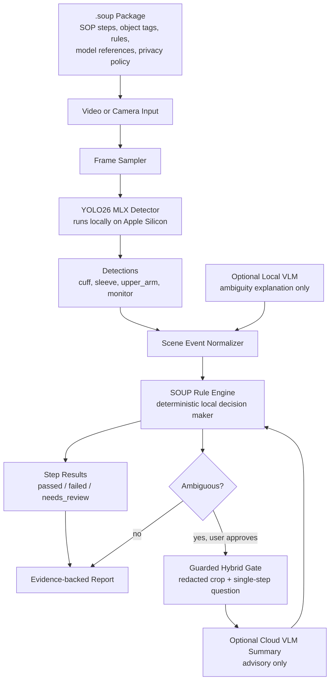

# SoPilot — A Copilot for Stand Operating Process 

## Physical SOPs, Checked Locally — Not Guessed in the Cloud

**SoPilot turns physical procedures into executable visual rules.** It uses **YOLO26 MLX** to detect real-world workflow evidence on Apple Silicon, packages SOP logic into portable `.soup` files, and lets a deterministic local rule engine decide whether each step passed, failed, or needs review.

> **Selling point:** SoPilot is not a generic “ask a VLM if the video looks right” demo. It is a lower-cost, auditable, local-first SOP validation engine for healthcare, manufacturing, field service, labs, training, and safety workflows.

---

## Hackathon Snapshot

| Item | Details |
|---|---|
| Challenge | webAI YOLO26 MLX Build Challenge — May 2026 |
| Track | **Enterprise** — also useful for healthcare/home SOP validation |
| Project | **SoPilot** — local-first SOP video checker powered by the SOUP Engine |
| Core model | `yolo26n` / YOLO26 MLX, Apple Silicon-native object detection |
| Demo use case | Blood Pressure Monitor SOP Checker |
| 1-minute demo video | **TODO: paste 1-minute demo video URL here** |
| Social post | **TODO: paste X or LinkedIn post URL here** — include `#YOLOMLX` and tag webAI |
| Hardware used | **TODO: fill exact Mac model, chip, and RAM** — e.g. `MacBook Pro, M4 Pro, 24GB RAM` |
| Team | **TODO: Zhen Song / team members** |
| Registration form | **TODO: confirmed completed** |

Official challenge checklist: public GitHub repo, README with what/why/how-to-run/hardware/model variant, 60-second demo video, social post, and registration confirmation. See the [webAI challenge brief](https://community.webai.com/t/the-yolo26-mlx-build-challenge-may-2026/16).

---

## What It Does

SoPilot validates whether a recorded physical workflow follows a Standard Operating Procedure.

For the hackathon demo, the workflow is a **Blood Pressure Monitor SOP**:

1. Monitor is visible.
2. Sleeve is rolled up / not blocking the cuff.
3. Cuff is placed on the upper arm.
4. Cuff is above the elbow bend.
5. Measurement starts only after setup is complete.

Instead of asking a cloud VLM to make a black-box judgment, SoPilot does three things:

1. **Detects domain objects locally** with YOLO26 MLX.
2. **Converts detections into structured evidence** such as `cuff`, `sleeve`, `upper_arm`, and `measurement_done`.
3. **Evaluates deterministic `.soup` rules locally** to produce `passed`, `failed`, or `needs_review` with evidence and traceability.

---

## Why We Built It

Physical SOPs are everywhere: medical-device setup, manufacturing inspections, HVAC repair, lab protocols, workplace safety, and training checklists. Today, validation is often manual, self-reported, or buried in video archives.

A naive AI approach is: “Send the video to a VLM and ask whether the user did it correctly.” That breaks down in real-world SOPs because:

- **Privacy:** raw video of medical, home, or workplace procedures should not leave the device by default.
- **Cost:** fine-tuning a large VLM for every domain-specific object is expensive.
- **Auditability:** a free-form VLM answer does not explain which SOP step failed and why.

SoPilot’s answer is the **SOUP Engine** — **S**tandard **O**perating **U**nderstanding **P**ackage engine.

A `.soup` package makes a physical SOP installable, inspectable, and executable:

```text
BP Monitor SOP
   ↓
.soup package = steps + tags + rules + model references + privacy policy
   ↓
YOLO26 MLX detects local evidence
   ↓
SOUP rule engine checks the procedure
   ↓
Evidence-backed pass / fail / needs-review result
```

---

## Inspiration: Physical AI Should Reach Small Businesses

This project is inspired by NVIDIA GTC’s physical-AI direction (https://www.youtube.com/watch?v=lQHK61IDFH4&t=5464s around 1:31:06): AI is moving from chat boxes and dashboards into real-world systems that perceive, reason, and act in physical environments. NVIDIA’s GTC Washington, D.C. event highlighted physical and agentic AI, remote sensing, HPC, and quantum computing, while GTC 2026 highlighted physical AI, robotics, agentic systems, inference, and AI factories.

SoPilot asks a practical question:

> **Can physical AI be made affordable and trustworthy for small businesses, clinics, labs, and local operators — without requiring a VLM fine-tuning budget or cloud-video pipeline?**

References:

- [NVIDIA GTC Washington, D.C.](ttps://www.youtube.com/watch?v=lQHK61IDFH4&t=5464s)

---

## The Cost Reduction Thesis

The SOUP Engine reduces cost by moving domain-specific learning from a large VLM into a small YOLO detector plus explicit local rules.

| Approach | 10-SOP pilot dev cost | 100-SOP productization dev cost | Key problem |
|---|---:|---:|---|
| VLM fine-tuning path | ~$23k–$71k | ~$82k–$312k | High labor, VLM eval/finetune complexity, GPU/MLOps overhead |
| SOUP hybrid path | ~$8k–$20k | ~$51k–$154k | Requires SOP/rule authoring and YOLO labels, but avoids VLM fine-tuning |
| Estimated savings | **~50–75%** | **~52%+ depending on mode** | Biggest win is eliminating the VLM fine-tune loop |

The key design choice:

> **Do not fine-tune the VLM first. Train a small YOLO detector for domain objects, then let a deterministic local rule engine make the final decision.**

In the BP use case, the current demo model focuses on three custom visual classes:

```text
cuff
sleeve
upper_arm
```

The SOUP rule engine then checks whether those detections satisfy the SOP state machine.

---

## System Architecture

### SOUP Dataflow Diagram



Optional source diagram from the SOUP design document:


### Runtime Contract

```text
Camera / Video
   ↓
Frame Sampler
   ↓
YOLO26 MLX / Tracker          Optional Local VLM
known objects + geometry       ambiguous scene reasoning
   ↓                            ↓
Structured Detections + Scene Events
   ↓
SOUP Rule Engine
   ↓
Pass / Fail / Needs Review + Evidence Trace
```

The rule engine is the source of truth. VLMs may assist, but they do not make the final SOP decision.

---

## Blood Pressure Monitor Use Case

The BP use case demonstrates why SOUP is more than object detection. The system must understand object relationships, timing, and workflow order.

### Correct workflow


The user rolls up the sleeve, places the cuff on the upper arm, and completes the measurement. YOLO provides visual evidence, then the SOUP rule engine advances through all required states and accepts the final `measurement_done` event.

### Sleeve-not-rolled failure


The cuff overlaps the sleeve. The system should not call this a completed BP measurement. The rule trace should tell the user exactly where to recover: return to the sleeve step and roll it up.

### Process-hack / ambiguous case


The user presents cuff-like visual evidence without clearly placing the cuff on the upper arm. YOLO still detects relevant objects, but the semantic action is not confirmed. SOUP returns `needs_review` instead of incorrectly passing the workflow.

### Geometric relationship example


Many SOP checks reduce to object relationships: `above`, `below`, `near`, `inside`, `overlaps`, `contains`, or `aligned_with`. SOUP exposes these as readable rules instead of burying them in custom code.

---

## Screenshots

### Screenshot 1 — Live YOLO26 MLX Analysis


> TODO: replace with a screenshot showing SoPilot analyzing the BP workflow video, with YOLO boxes for `cuff`, `sleeve`, and `upper_arm`.

### Screenshot 2 — SOUP Rule Trace Report


> TODO: replace with a screenshot showing the step-level report: monitor visible, sleeve clear, cuff on upper arm, cuff above elbow, measurement after setup.

---

## Demo Result: BP Monitor Rule Trace

Example end-to-end result for `BP_correct.mp4`:

| SOP state | Rule ID | Type | Decision | Confidence | Completed at |
|---|---|---|---:|---:|---:|
| Start | `S0_monitor_visible_before_measure` | `exists_before` | ✅ passed | 1.00 | 0.00s |
| Roll sleeve | `S1_sleeve_clear_or_on_upper_arm` | `any_of` | ✅ passed | — | — |
| Put cuff on upper arm | `S2_cuff_overlaps_upper_arm` | `overlap` | ✅ passed | 0.898 | 53.04s |
| Measure | `S3_measure_after_setup` | `after_all_required` | ✅ passed | — | 53.04s |
| Done | `S4_done_after_measure` | `after_all_required` | ✅ passed | — | 53.04s |

```text
FINAL_SOUP_STATUS=passed
TASK_FINISHED=true
```

For failure and hack attempts, the engine returns either:

```text
FINAL_SOUP_STATUS=quit
ERROR=need to roll up sleeve, go to 'S1' step
```

or:

```text
FINAL_SOUP_STATUS=needs_review
TASK_FINISHED=false
```

---

## How YOLO26 MLX Is Used

YOLO26 MLX is central to the demo, not decorative.

| Component | Role |
|---|---|
| YOLO26 MLX | Local object detector for workflow evidence |
| Model variant | `yolo26n` for the hackathon BP demo |
| Custom classes | `cuff`, `sleeve`, `upper_arm` |
| Runtime | Local Apple Silicon inference through MLX |
| Output | Bounding boxes, labels, confidence scores |
| SOUP usage | Detections become rule-engine evidence |

The detector finds the domain-specific objects that a general VLM may miss. The `.soup` rules then evaluate relationships such as cuff-over-arm, cuff-over-sleeve, and correct sequencing.

---

## How To Run

> Update the command names if your repo entrypoint differs. The important submission requirement is that judges can run the demo without guessing.

### 1. Clone

```bash
git clone <YOUR_PUBLIC_GITHUB_REPO_URL>
cd SoPilot
```

### 2. Create environment

```bash
python3 -m venv .venv
source .venv/bin/activate
python -m pip install --upgrade pip
pip install -r requirements.txt
```

### 3. Install / verify YOLO26 MLX dependencies

```bash
python -c "import mlx; print('MLX ready')"
python -c "import cv2; print('OpenCV ready')"
```

### 4. Run the BP Monitor SOUP demo

```bash
python scripts/run_bp_soup_demo.py \
  --video sandbox/BP-video/BP_correct.mp4 \
  --model images/BP_sc_runs/train/bp_sc_yolo26n.npz \
  --soup sandbox/soup-engine/tests/fixtures/bp/bp_monitor.soup.json \
  --class-map "0:cuff,1:sleeve,2:upper_arm"
```

Expected output:

```text
SOUP state=Start ... decision=passed
SOUP state=Roll sleeve ... decision=passed
SOUP state=Put Cuff On Upper Arm ... decision=passed
SOUP state=Measure ... decision=passed
SOUP state=Done ... decision=passed
FINAL_SOUP_STATUS=passed
TASK_FINISHED=true
```

### 5. Run failure case

```bash
python scripts/run_bp_soup_demo.py \
  --video sandbox/BP-video/BP_sleeve_wrong.mp4 \
  --model images/BP_sc_runs/train/bp_sc_yolo26n.npz \
  --soup sandbox/soup-engine/tests/fixtures/bp/bp_monitor.soup.json
```

Expected output:

```text
FINAL_SOUP_STATUS=quit
ERROR=need to roll up sleeve, go to 'S1' step
TASK_FINISHED=false
```

---

## Repository Structure

```text
SoPilot/
  README.md
  SOUP.md
  requirements.txt
  scripts/
    run_bp_soup_demo.py
  sandbox/
    BP-video/
      BP_correct.mp4
      BP_sleeve_wrong.mp4
      BP_hack.mp4
    soup-engine/
      tests/fixtures/bp/
        bp_monitor.soup.json
        bp_hack_vlm_crosscheck.soup.json
  images/
    BP_sc_runs/train/
      bp_sc_yolo26n.npz
  sopilot_rules/
    __init__.py
    schema.py
    engine.py
    evaluators/
    geometry.py
    privacy.py
    evidence.py
  doc/
    img/
      SOUP-dataflow-glass3.png
      yolo-cuff038.03s.png
      yolo_cuff_sleeve014.png
      yolo-hack1.png
      cuff-ipad-table.png
      TODO_screenshot_live_yolo_overlay.png
      TODO_screenshot_soup_result_report.png
```

---

## `.soup` Package Example

A `.soup` package is the executable SOP definition. It separates perception from rules.

```json
{
  "package": {
    "id": "bp_monitor_sop_checker",
    "name": "Blood Pressure Monitor SOP Checker",
    "version": "0.1.0",
    "category": "Healthcare Workflow",
    "description": "Checks whether a user sets up a blood pressure monitor workflow correctly.",
    "safety_note": "For workflow assistance only. Not medical diagnosis."
  },
  "models": {
    "detector": {
      "type": "yolo",
      "format": "npz",
      "runtime": "local",
      "local_path": "images/BP_sc_runs/train/bp_sc_yolo26n.npz"
    }
  },
  "steps": [
    {"id": "monitor_visible", "name": "Monitor is visible", "required": true, "order": 1},
    {"id": "sleeve_clear", "name": "Sleeve is rolled up", "required": true, "order": 2},
    {"id": "cuff_on_upper_arm", "name": "Cuff is on upper arm", "required": true, "order": 3},
    {"id": "cuff_above_elbow", "name": "Cuff is above elbow bend", "required": true, "order": 4},
    {"id": "start_after_setup", "name": "Start is pressed after setup", "required": true, "order": 5}
  ]
}
```

Example rule:

```json
{
  "id": "S2_cuff_overlaps_upper_arm",
  "step_id": "cuff_on_upper_arm",
  "type": "overlap",
  "source_tag": "cuff",
  "target_tag": "upper_arm",
  "min_confidence": 0.5,
  "failure_message": "The cuff was not confirmed on the upper arm."
}
```

---

## Privacy and Safety Model

SoPilot is local-first by design.

| Data / decision | Default behavior |
|---|---|
| Raw video | Stays local |
| YOLO model | Runs locally |
| SOP rules | Stay local |
| Final pass/fail decision | Local rule engine only |
| Local VLM | Optional, advisory, ambiguity explanation |
| Cloud VLM | Optional, user-approved, redacted/minimized, advisory only |

Blocked from cloud by policy:

```text
raw video
full SOP script
full .soup package
yolo model weights
unredacted face/background frames
```

This is important for healthcare, workplace, factory, lab, and home workflows where raw video may be sensitive.

---

## Why This Is Different

Most VLM demos ask:

> “Did this video follow the process?”

SoPilot asks a better question:

> “Which SOP step is this visual evidence allowed to satisfy, under what rule, with what confidence, and what local audit trace?”

| Generic VLM SOP checker | SoPilot / SOUP Engine |
|---|---|
| Cloud-first video understanding | Local-first visual evidence |
| Free-form answer | Structured pass/fail/needs-review |
| Hard to audit | Step-level rule trace |
| Requires domain VLM tuning for long-tail objects | Fine-tune/train small YOLO detector instead |
| Rules hidden in prompts | Rules packaged as inspectable `.soup` JSON |
| Cloud model may become decision maker | Local rule engine is always final decision maker |

---

## Hackathon Judging Alignment

| webAI judging category | How SoPilot addresses it |
|---|---|
| YOLO26 MLX / on-device execution | YOLO26 MLX detects BP workflow objects locally on Apple Silicon |
| Demo quality / shipping completeness | BP demo has correct, failure, and hack/ambiguous cases |
| Impact / usefulness | SOP validation is valuable for healthcare, manufacturing, field service, training, and safety |
| Technical execution | Hybrid architecture: YOLO → normalized events → deterministic rule engine → evidence report |
| Creativity / originality | Turns object detection into installable executable SOP packages |
| Presentation / storytelling | Clear physical-AI thesis: make SOP validation affordable, private, and auditable |

---

## Limitations

This is a hackathon MVP, not a regulated medical product.

- The BP demo is for workflow assistance only, not medical diagnosis.
- The current demo detector focuses on `cuff`, `sleeve`, and `upper_arm`.
- Some events such as `measurement_done` may be simulated or inferred in the current test harness.
- More data is needed for robust camera angles, lighting, occlusion, skin tones, clothing types, and device variants.
- Guarded Hybrid VLM support is advisory only and should remain optional.

---

## Roadmap

1. Replace synthetic BP events with real UI/device/video-derived events.
2. Expand YOLO labels: `blood_pressure_monitor`, `grey_connector`, `button`, `elbow_bend`.
3. Add tracker stabilization and temporal smoothing.
4. Add Creator Mode for labeling, rule authoring, and `.soup` export.
5. Add local evidence review UI.
6. Add privacy log export.
7. Publish a SOUP package gallery / marketplace.

---

## Submission Links

- GitHub repo: **TODO: paste public GitHub repo URL**
- 1-minute demo video: **TODO: paste video URL**
- Social post: **TODO: paste X or LinkedIn URL**
- webAI community reply: **TODO: paste reply URL after posting**

---

## Final Slogan

**Stop asking AI to guess the SOP. Ship the SOP as code.**

**SOUP turns real-world procedures into executable vision — local, affordable, and auditable.**
